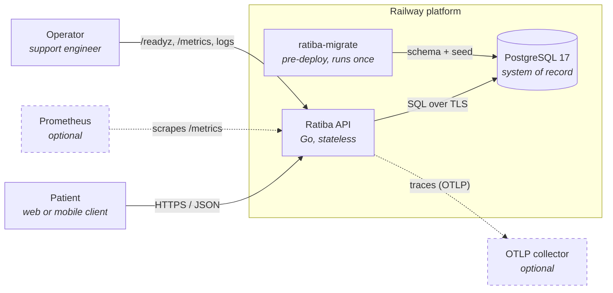
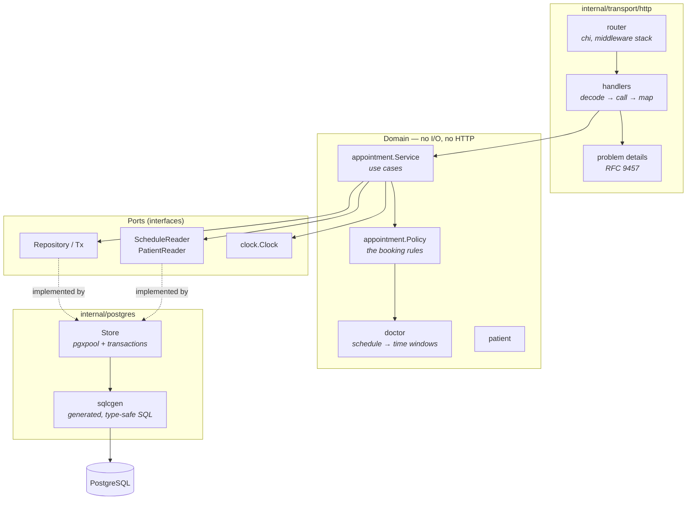
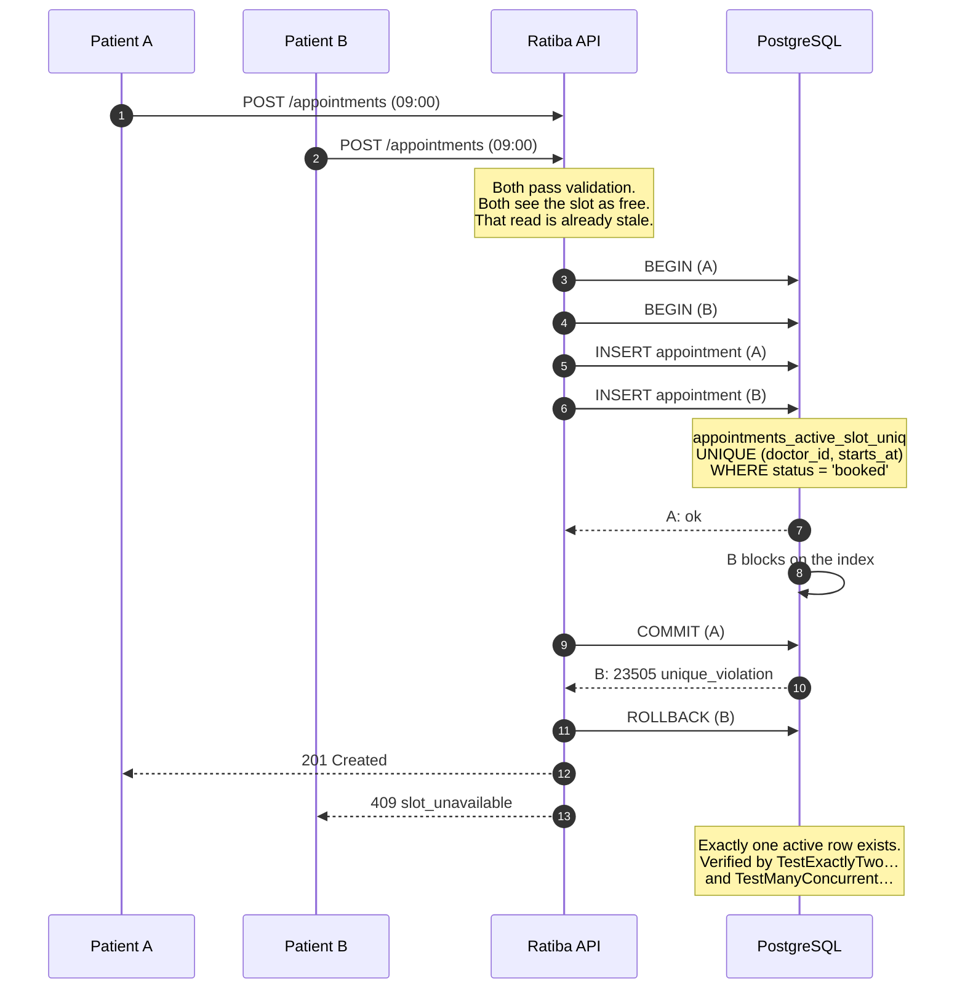
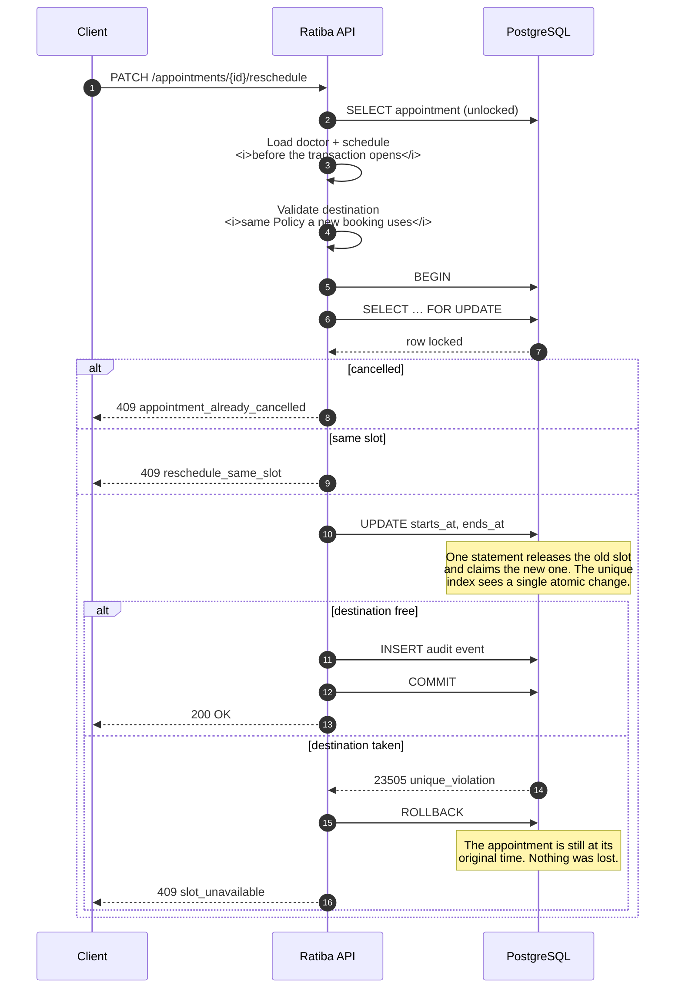
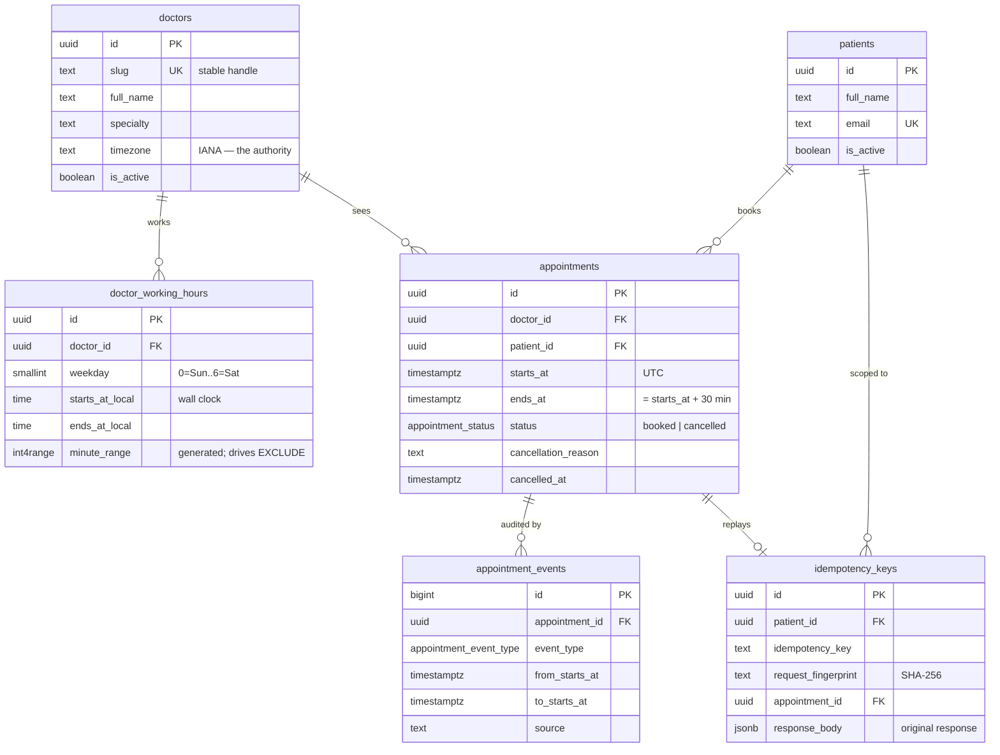
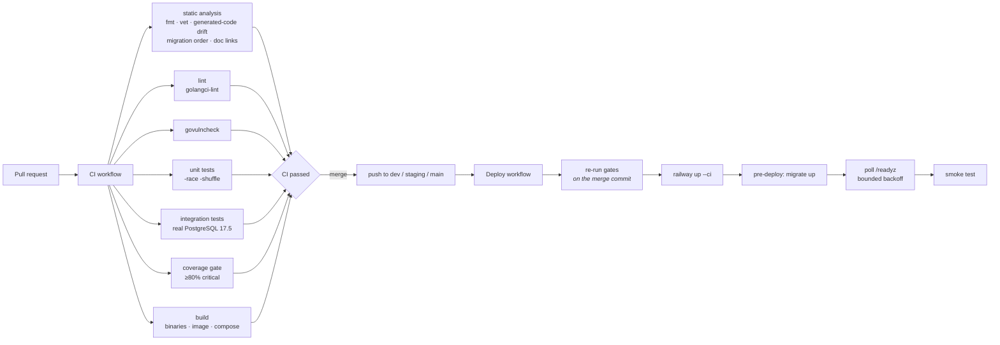

# Ratiba — Clinic Appointment API

> *Ratiba* is Swahili for **schedule**.

A production-grade REST API for booking 30-minute clinic appointments, written
in Go against PostgreSQL. Built for the Savannah Informatics backend take-home
assessment.

The central engineering claim of this project is narrow and testable:

> **A doctor's slot can never be double-booked — not by two simultaneous
> requests, not across multiple application replicas, not ever.**

That guarantee lives in a PostgreSQL partial unique index, not in Go, and it is
proven by integration tests that run real concurrent transactions against a real
database. Everything else in the design follows from taking that one claim
seriously.

---

## Status

| | |
|---|---|
| **Public URL** | **https://ratiba-api-production.up.railway.app** |
| **API docs** | [https://ratiba-api-production.up.railway.app/docs](https://ratiba-api-production.up.railway.app/docs) · [raw contract](https://ratiba-api-production.up.railway.app/openapi.yaml) |
| **Health** | [https://ratiba-api-production.up.railway.app/readyz](https://ratiba-api-production.up.railway.app/readyz) · [https://ratiba-api-production.up.railway.app/livez](https://ratiba-api-production.up.railway.app/livez) |
| **Try it** | [`GET /doctors`](https://ratiba-api-production.up.railway.app/doctors) · [error catalogue](https://ratiba-api-production.up.railway.app/problems) |
| **CI** | [`.github/workflows/ci.yml`](.github/workflows/ci.yml) — runs on every pull request |
| **CD** | [`.github/workflows/deploy.yml`](.github/workflows/deploy.yml) — deploys on push to `dev`, `staging`, `main` |

No URL, coverage number, or command result in this README is claimed without
having actually been run. Where something has not been verified, it says so.

---

## Documentation

The README is a map. The detail lives in linked documents so this page stays
readable.

| Document | What it answers |
|---|---|
| [docs/architecture.md](docs/architecture.md) | How is the system put together, and why that way? |
| [docs/api.md](docs/api.md) | How do I call it? Every endpoint, with copy-paste examples. |
| [docs/data-model.md](docs/data-model.md) | What is stored, what invariants hold, and how double-booking is prevented. |
| [docs/testing.md](docs/testing.md) | What is tested, how to run it, and how to debug a failure. |
| [docs/operations.md](docs/operations.md) | Configuration, logs, metrics, traces, and how to debug a live request. |
| [docs/deployment.md](docs/deployment.md) | Branch → environment mapping, Railway setup, rollback. |
| [docs/security.md](docs/security.md) | Threat model, what is protected, and what is deliberately not. |
| [docs/glossary.md](docs/glossary.md) | Clinic and technical terms used throughout. |
| [CONTRIBUTING.md](CONTRIBUTING.md) | Setup from a fresh clone, the development loop, where new code goes. |
| [docs/adr/](docs/adr/) | Numbered decision records for the choices worth arguing about. |
| [docs/runbooks/](docs/runbooks/) | Symptom-first incident procedures. |
| [AI_REFLECTION.md](AI_REFLECTION.md) | Section 4 of the assessment. |
| [api/examples.http](api/examples.http) | Runnable request collection for the full lifecycle. |
| [docs/onboarding-rehearsal.md](docs/onboarding-rehearsal.md) | Evidence that the setup instructions actually work from a clean checkout. |
| [docs/assessment-traceability.md](docs/assessment-traceability.md) | Every assessment requirement mapped to where it is implemented and proven. |
| [docs/ai-worklog.md](docs/ai-worklog.md) | Dated log of where AI was used and how each output was verified. |

---

## The problem

> *"We run a small clinic with 5 doctors. Patients need to book appointments
> online. Each doctor has set working hours and works in 30-minute slots. A
> patient should see which slots are free for a given doctor on a given day, pick
> one, and book it. Once booked, that slot must not be available to others.
> Patients should also be able to cancel. We're starting small but want to grow."*

### Feature checklist

**Required**

- [x] `POST /appointments` — book a slot, validated against working hours, the past, and existing bookings
- [x] `GET /doctors/{id}/availability?date=YYYY-MM-DD` — free 30-minute slots for a doctor on a date
- [x] `PATCH /appointments/{id}/cancel` — cancel with a reason; the slot becomes bookable again; rejects an already-cancelled appointment
- [x] `PATCH /appointments/{id}/reschedule` — atomic move; destination validated exactly like a fresh booking; rejects a cancelled appointment
- [x] Meaningful validation errors with correct HTTP status codes ([RFC 9457](https://www.rfc-editor.org/rfc/rfc9457) problem documents with stable machine-readable codes)
- [x] Sensible multi-file structure (a feature-oriented modular monolith)
- [x] Tests of the booking logic

**Bonus**

- [x] `GET /patients/{id}/appointments` — upcoming appointments, chronologically ordered
- [x] Bookings inside one hour of now are rejected

**Deployment and CI/CD**

- [x] CI runs the full test suite on every pull request
- [x] Push to a protected branch (which is what merging a PR produces) deploys automatically
- [x] Deployment configured as code (`railway.json`) with three isolated environments
- [x] Deployed to a public URL on Railway, across three isolated environments

**Beyond the brief** — added because the role is technical-support focused, and
these are what make an API debuggable at 2am:

- `Idempotency-Key` support on booking, so a retried request cannot double-book
- Structured JSON logs with request-ID and trace-ID correlation
- Prometheus metrics with strictly bounded label cardinality
- OpenTelemetry tracing through HTTP and SQL, degrading safely when no collector exists
- An error catalogue served at `/problems`, so every error code is self-documenting
- An OpenAPI contract validated in CI and checked against the actual routes in both directions

---

## Quick start

```bash
cp .env.example .env
docker compose up --build
curl http://localhost:8080/readyz
```

Migrations and seed data run automatically as ordered one-shot services before
the API starts. Then:

```bash
# What can Dr. Amina Wanjiru do next Monday?
curl "http://localhost:8080/doctors/7f3c0a1e-1111-4a10-9c01-000000000001/availability?date=2026-09-07"

# Book the first free slot
curl -X POST http://localhost:8080/appointments \
  -H 'Content-Type: application/json' \
  -d '{
        "doctor_id":  "7f3c0a1e-1111-4a10-9c01-000000000001",
        "patient_id": "9b2d5e40-2222-4b20-8d02-000000000001",
        "starts_at":  "2026-09-07T06:00:00Z"
      }'
```

Prefer a task runner? `make help` lists everything. `make doctor` checks your
machine and tells you exactly what is missing.

Full setup, including running natively without Docker, is in
[CONTRIBUTING.md](CONTRIBUTING.md).

### Demo identifiers

Seed data is deterministic, so these IDs work on any fresh instance. You never
need to open the database to use the API.

**Doctors** — `GET /doctors`

| ID | Name | Specialty | Timezone | Working hours |
|---|---|---|---|---|
| `7f3c0a1e-1111-4a10-9c01-000000000001` | Dr. Amina Wanjiru | General Practice | `Africa/Nairobi` | Mon–Fri 09:00–13:00, 14:00–17:00 |
| `7f3c0a1e-1111-4a10-9c01-000000000002` | Dr. Otieno Mwangi | Paediatrics | `Africa/Nairobi` | Mon/Wed/Fri 08:00–12:00; Tue/Thu 13:00–17:00 |
| `7f3c0a1e-1111-4a10-9c01-000000000003` | Dr. Fatuma Hassan | Dermatology | `Africa/Nairobi` | Tue–Sat 10:00–16:00 |
| `7f3c0a1e-1111-4a10-9c01-000000000004` | Dr. Njeri Kamau | Cardiology | `Africa/Nairobi` | Mon–Thu 08:30–12:30 |
| `7f3c0a1e-1111-4a10-9c01-000000000005` | Dr. Samuel Kiptoo | Physiotherapy | **`Europe/London`** | Mon–Fri 09:00–12:00, 13:00–16:30 |

Dr. Kiptoo is in a different timezone on purpose. A clinic where everyone shares
one UTC offset would let a timezone bug hide indefinitely; London observes DST,
so the timezone handling is exercised by the demo data itself, not only by tests.

**Patients** — `GET /patients`

| ID | Name | Active |
|---|---|---|
| `9b2d5e40-2222-4b20-8d02-000000000001` | Grace Achieng | yes |
| `9b2d5e40-2222-4b20-8d02-000000000002` | Brian Omondi | yes |
| `9b2d5e40-2222-4b20-8d02-000000000003` | Lucy Njoroge | yes |
| `9b2d5e40-2222-4b20-8d02-000000000004` | Peter Mutiso | yes |
| `9b2d5e40-2222-4b20-8d02-000000000005` | Halima Yusuf | yes |
| `9b2d5e40-2222-4b20-8d02-000000000006` | Daniel Kariuki | **no** — exercises the `patient_inactive` rejection |

All people are fictitious; every address uses the reserved `example.com` domain.

---

## System design

### Context



The API is stateless. Every piece of state that matters lives in PostgreSQL,
which is what makes horizontal scaling a configuration change rather than a
redesign.

### Components



Dependencies point inward. The domain declares the interfaces it needs and knows
nothing about pgx, chi or HTTP — which is why the entire rule set can be tested
in milliseconds with no database.

### Booking under concurrency

This is the sequence that matters. Two patients want the same slot:



The application never decides who wins. It asks the database to insert, and
treats a unique-constraint violation as the authoritative answer. Any check
performed in Go before the insert exists only to produce a *better error message
faster* — it is never the thing that prevents the conflict.

### Rescheduling atomically

Rescheduling is where a naive implementation loses an appointment. "Delete the
old, insert the new" leaves the patient with nothing if the second step fails.



Loading the doctor and schedule *before* opening the transaction is deliberate.
Acquiring a second pool connection while holding a transaction is how a
connection pool deadlocks itself under load; the service maintains the invariant
that no repository read ever happens inside a `WithinTx` callback.

### Data model



The invariants, and where each is enforced, are in
[docs/data-model.md](docs/data-model.md).

---

## Key decisions and trade-offs

Full decision records are in [docs/adr/](docs/adr/). The short version:

### Correctness belongs in the database

A partial unique index on `(doctor_id, starts_at) WHERE status = 'booked'` is
the entire no-double-booking mechanism.

*Alternatives considered.* An application-level lock fails across replicas. A
`SELECT … FOR UPDATE` on the doctor row serialises every booking for that doctor,
including for unrelated slots. A PostgreSQL `EXCLUDE` constraint over a
`tstzrange` handles arbitrary overlapping durations, but slots here are fixed and
aligned, so equality on the start instant is sufficient — and a unique index is
smaller, faster and understood by every engineer who will ever read it.

*Trade-off.* If appointments ever gain variable durations, this must become an
exclusion constraint. That is a migration, and it is recorded in
[ADR 0003](docs/adr/0003-concurrency-strategy.md).

### One policy, three endpoints

Availability, booking and rescheduling all run through the same
`appointment.Policy`. A slot returned by the availability endpoint is bookable
*by construction*, and a reschedule destination is validated by literally the
same code path as a fresh booking.

"Aligned to `:00`/`:30`" is not a separate modulo check — a start is aligned
precisely when it appears in the list the generator produces. Deriving alignment
from generation rather than checking it independently means the two can never
disagree, including across a DST transition.

### Timezones: store instants, interpret in the doctor's zone

Instants are `timestamptz` in UTC. A doctor's IANA timezone is the sole
authority for interpreting their working hours and for deciding which calendar
day a slot belongs to. The host machine's timezone is never consulted, and the
zone database is compiled into the binary so a distroless container resolves
`Africa/Nairobi` correctly with no OS `tzdata`.

Around a DST transition, working hours stay fixed in wall-clock terms — a 09:00
appointment remains at 09:00 local — while its UTC instant shifts. A window that
a transition passes through has fewer real hours than the clock suggests, and
the generator emits correspondingly fewer slots. Tested in
[`policy_test.go`](internal/appointment/policy_test.go).

### Idempotent booking

`POST /appointments` accepts an `Idempotency-Key`. The key, a fingerprint of the
request, and a snapshot of the original response are written in the *same
transaction* as the appointment, so a committed key always has a committed
appointment.

The retry path has a subtlety worth naming, because writing it down is what
found the bug: the appointment INSERT is attempted before the key INSERT (the
key row has a foreign key to the appointment), so a retry that races its own
original trips the *slot* index first and would naively be answered `409
slot_unavailable`. The service therefore checks for a committed twin before
reporting a conflict. This was caught by
`TestConcurrentIdempotentRetries`, not by review — see
[AI_REFLECTION.md](AI_REFLECTION.md).

*Scope.* Keys are scoped `(patient_id, key)`. With no authentication, the
patient in the body is the closest thing to a client principal. When auth lands,
the scope becomes `(authenticated principal, key)` with no other change.

### Modular monolith, not microservices

Five doctors and one bounded context. Microservices would add network calls,
distributed transactions and independent deployment pipelines to a system whose
core invariant is a single unique index. The package structure keeps clear
seams — the domain has no I/O dependencies — so extracting a service later is
mechanical rather than a rewrite.

### Deliberately left out

| Not built | Why | Where it is discussed |
|---|---|---|
| Authentication / authorisation | Out of scope for the assessment. Every endpoint is unauthenticated. This is a **known, documented gap**, not an oversight — pretending otherwise would be the dishonest choice. | [docs/security.md](docs/security.md) |
| Rate limiting | Needs shared state across replicas to be meaningful. Single-instance limiting gives false confidence. | [docs/security.md](docs/security.md) |
| Notifications, billing, a frontend | Not in the brief. | — |
| Recurring appointments, waitlists, overbooking | Not in the brief; each would change the slot model. | [docs/adr/0003-concurrency-strategy.md](docs/adr/0003-concurrency-strategy.md) |
| Keyset pagination | Offset paging is bounded and deterministic at this data volume. Keyset matters at a scale this system is not at. | [docs/api.md](docs/api.md#pagination) |
| A cache | Availability is a single indexed query. A cache would add a staleness bug to a problem that does not exist yet. | — |

---

## API

Full reference with examples: [docs/api.md](docs/api.md). Machine-readable
contract: [api/openapi.yaml](api/openapi.yaml), also served at `/openapi.yaml`.
Runnable collection: [api/examples.http](api/examples.http).

| Method | Path | Purpose |
|---|---|---|
| `POST` | `/appointments` | Book a slot |
| `GET` | `/appointments/{id}` | Fetch an appointment |
| `PATCH` | `/appointments/{id}/cancel` | Cancel with a reason |
| `PATCH` | `/appointments/{id}/reschedule` | Move to a new slot |
| `GET` | `/doctors/{id}/availability?date=` | Free slots on a local date |
| `GET` | `/patients/{id}/appointments` | Upcoming appointments |
| `GET` | `/doctors`, `/doctors/{id}` | Doctor directory |
| `GET` | `/patients`, `/patients/{id}` | Patient directory |
| `GET` | `/livez`, `/readyz` | Health probes |
| `GET` | `/metrics` | Prometheus metrics (token-protected when configured) |
| `GET` | `/problems`, `/problems/{code}` | Error code catalogue |

### Error format

Every error is an RFC 9457 problem document:

```json
{
  "type": "/problems/slot_unavailable",
  "title": "Conflict",
  "status": 409,
  "detail": "That slot is no longer available.",
  "instance": "/appointments",
  "code": "slot_unavailable",
  "request_id": "018f4e0a-1c2b-7d3e-9f01-2a3b4c5d6e7f"
}
```

Branch on `code`, never on `title` or `detail`. `type` resolves: `GET
/problems/slot_unavailable` explains the code and what to do about it.

**Status code semantics**

| Status | Meaning |
|---|---|
| `400` | The request could not be understood — bad JSON, unknown field, unparseable UUID or date |
| `404` | A referenced doctor, patient or appointment does not exist |
| `409` | Conflict with current state — slot taken, already cancelled, key reused |
| `413` / `415` | Body too large / wrong content type |
| `422` | Understood but refused by a business rule — outside working hours, misaligned, too soon |
| `500` | Unexpected. Body carries a `request_id` and nothing else |
| `503` | Draining, timed out, or a dependency is unavailable |

The `400` versus `422` split is the one worth stating: `400` means *"I could not
parse this"*, `422` means *"I understood you perfectly and I am refusing"*.

---

## Testing

Detail and troubleshooting: [docs/testing.md](docs/testing.md).

```bash
make unit-test          # fast, no database, race detector on
make integration-test   # real PostgreSQL, includes the concurrency proofs
make test               # both
make coverage           # both, with the threshold enforced
```

### Measured coverage

Run on 2026-08-21 with `make coverage` (unit and integration suites combined,
`-race`, `-covermode=atomic`):

| Package | Coverage |
|---|---|
| `internal/patient` | **100.0%** |
| `internal/doctor` | **98.9%** |
| `internal/platform/config` | **88.3%** |
| `internal/appointment` | **84.6%** |
| `internal/transport/http` | 72.8% |
| `internal/postgres` | 65.7% |
| **Total** | **67.7%** |

The gate enforces ≥80% on `appointment`, `doctor` and `patient` — the packages
that hold the business rules. It is deliberately *not* a module-wide average:
one number over generated code, wiring and `main` is easy to inflate and would
let the booking logic rot while the percentage stayed green.

### What the concurrency tests actually assert

These run against real PostgreSQL with `-race`:

| Test | Claim |
|---|---|
| `TestExactlyTwoConcurrentBookingsForTheSameSlot` | Two simultaneous requests → exactly one `201`, one `409`, **one row** |
| `TestManyConcurrentBookingsForTheSameSlot` | 24 simultaneous requests → exactly one winner |
| `TestConcurrentBookingsForDifferentSlotsAllSucceed` | Unrelated slots are not serialised (catches an over-broad lock) |
| `TestConcurrentIdempotentRetries` | 8 same-key retries → one appointment, one audit event, all callers get it |
| `TestConcurrentCancellations` | Row lock serialises; exactly one caller cancels |
| `TestConcurrentReschedulesOntoOneSlot` | One winner; **every loser keeps its original slot** |
| `TestRescheduleAtomicity` | A failed move leaves the appointment untouched |
| `TestMigrationsRollBackAndReapply` | Every migration has a working `Down` |

---

## Observability

Detail: [docs/operations.md](docs/operations.md). Incident procedures:
[docs/runbooks/](docs/runbooks/).

**Logs.** JSON in deployed environments. Every completed request logs the
timestamp, severity, service, environment, version, commit, request ID, trace ID,
method, **matched route template** (never the raw path — that would put patient
UUIDs in every line and make log cardinality unbounded), status, duration and
response size.

Never logged: patient names, cancellation reasons, request bodies, credentials,
database URLs.

**Metrics.** `/metrics` exposes request count, duration, status class, in-flight
requests, response size, recovered panics, connection-pool health, and
`appointment_operations_total{operation,outcome}` — where the `(book, conflict)`
series is the double-booking-contention signal. Every label comes from a small
fixed vocabulary.

**Traces.** OpenTelemetry across inbound HTTP and PostgreSQL. Optional: with no
collector configured, instrumentation becomes a no-op rather than failing
startup. An observability backend being down must never take the API down.

**Correlating a user's report.** They quote a request ID from an error response
(or the `X-Request-Id` header). Search logs for it; every line from that request
carries it, including domain events written deep in the service layer. If
tracing was on, the same lines carry a `trace_id` that opens the full trace.
Step-by-step in [docs/operations.md](docs/operations.md#debugging-a-request).

Local stack: `make observability` starts Grafana, Prometheus, Tempo and an OTel
collector with datasources pre-provisioned. Kept behind a compose profile so
everyday startup stays fast.

---

## CI/CD



### Branch → environment mapping

| Git branch | GitHub environment | Railway environment | Database | Purpose |
|---|---|---|---|---|
| `dev` | `development` | `development` | dedicated | Integration |
| `staging` | `staging` | `staging` | dedicated | Release validation |
| `main` | `production` | `production` | dedicated | The submitted application |

**How "deploy on merge" works.** GitHub Actions has no "PR merged" event.
Merging a pull request produces a `push` to the target branch, and that push is
the trigger. This is the standard mechanism and is why the deploy workflow keys
off `push`, not `pull_request`.

Each environment has its own Railway PostgreSQL and its own project-scoped
`RAILWAY_TOKEN` stored as a GitHub Environment secret. Nothing is shared, so a
leaked development token cannot reach production data. Deployments are serialised
per environment by workflow concurrency, so two quick merges cannot have the
older commit land last.

### Rollback

**Application:** redeploy the previous release from Railway's deployment
history. The image is immutable, so this is exact.

**Database:** forward-fix with a new migration. Automatic down-migrations in
production are unsafe because a `DROP COLUMN` destroys data that the rollback
cannot recover — the schema goes back, the data does not. Down sections exist
and are tested, but they are for local development and CI.

Full procedure: [docs/deployment.md](docs/deployment.md#rollback).

### Recommended branch protection

Not applied — this repository's settings could not be verified from here. For
`main`, `staging` and `dev`: require pull requests, require the `CI passed`
status check, require conversation resolution, forbid force pushes and deletion,
and require at least one reviewer where the account plan allows. A required
reviewer on production still satisfies "deploys automatically on merge" — the
deploy is triggered by the merge and gated on approval, not initiated by hand.

---

## Deployment

Live on Railway across three isolated environments, each with its own
PostgreSQL, its own secrets, and its own project-scoped deploy token.

| Environment | Branch | URL |
|---|---|---|
| Production | `main` | https://ratiba-api-production.up.railway.app |
| Staging | `staging` | https://ratiba-api-staging.up.railway.app |
| Development | `dev` | https://ratiba-api-development.up.railway.app |

Each deploy runs `ratiba-migrate deploy` as a Railway pre-deploy step — schema
migrations followed by the idempotent demo dataset — from the same image that
then serves traffic. If it fails, the release is aborted and the previous
version keeps serving.

Verified against the live deployments: `/readyz` reports ready with a healthy
database in all three; the read-only smoke suite passes 17/17 against
production; the full book → conflict → idempotent retry → reschedule → cancel
lifecycle passes 27/27 against development and staging; and `GET /metrics`
returns `401` on production without a bearer token, which is the fail-closed
configuration rule doing its job in the real environment.

Full setup, rollback and teardown procedure: [docs/deployment.md](docs/deployment.md).

---

## Security

Threat model and full control list: [docs/security.md](docs/security.md).

**The headline:** there is no authentication. Any caller can read the patient
directory and book, cancel or reschedule any appointment. For an assessment with
fictitious data this is an accepted, documented scope decision. It would be
unacceptable for real patient data, and [docs/security.md](docs/security.md) sets
out precisely what would change.

Implemented regardless: parameterised SQL only, strict JSON decoding with
unknown-field rejection, request body limits, complete server timeouts,
fail-closed configuration validation, secret redaction in logs, CORS disabled by
default with wildcards rejected at startup, token-guarded metrics (mandatory in
production), pprof refused in production, a distroless non-root container with no
shell, and `govulncheck` in CI.

---

## Assumptions and known limitations

Ambiguities in the brief, resolved and recorded:

1. **Appointment duration is exactly 30 minutes**, enforced by a `CHECK`
   constraint. It is deliberately *not* an environment variable: exposing a
   setting that silently breaks every write would be worse than not having it.
   Changing it is a migration.
2. **Slot starts align to `:00`/`:30` in the doctor's timezone**, defined as
   membership in the generated slot list rather than a separate modulo check.
3. **A slot must fit entirely within one working-hours interval.** A 16:45 start
   in a 09:00–17:00 day is rejected, since the appointment would run past
   closing.
4. **The lead-time boundary is `starts_at >= now + 1h`.** Exactly one hour is
   allowed; one second less is not. Tested explicitly.
5. **Rescheduling to the current slot returns `409 reschedule_same_slot`**, not
   a silent success — a success would append a `rescheduled` audit event
   describing a move that never happened. ([ADR 0006](docs/adr/0006-reschedule-semantics.md))
6. **An inactive doctor is rejected identically everywhere** — availability,
   booking and rescheduling all return `422 doctor_inactive`. Offering slots for
   an unbookable doctor would be misleading.
7. **Working-hours intervals cannot cross midnight.** This keeps "which local day
   does this slot belong to?" a single-day question throughout the codebase. An
   overnight clinic would need this revisited.
8. **The patient list shows future active appointments only.** It answers "what
   do I still need to show up for?", not "what is my history?".
9. **Cancelled appointments are retained**, never hard-deleted. The audit trail
   is the point.
10. **Availability is advisory.** A listed slot can be taken a millisecond later.
    `POST /appointments` is the only authority.

Known limitations:

- **Single-replica default.** Correctness does not depend on it — the concurrency
  tests prove the invariant holds across transactions — but the connection budget
  must be re-checked before scaling out ([docs/operations.md](docs/operations.md#connection-budget)).
- **No auth**, as above.
- **Offset pagination** rather than keyset. Bounded and deterministic, but a
  concurrent insert can shift an item between page fetches.
- **`/docs` loads Swagger UI from a CDN.** The raw contract at `/openapi.yaml`
  has no external dependency and always works.
- **The idempotency-key sweep is a manual command**, not a scheduled job. An
  unattended cron nobody monitors is its own liability at this data volume.
- **`btree_gist` is required** for the working-hours exclusion constraint. It is
  standard contrib and available on Railway, but a Postgres without it will fail
  the first migration — loudly, at pre-deploy, which is the right place.

---

## AI usage

AI tooling was used throughout, and heaviest on the repetitive, pattern-shaped
and exhaustive parts of the work — handlers, test matrices, comment density,
security checklists and documentation. The architecture, the invariants and the
trade-offs were decided first and held closely.

The reflection is specific about both, including a bug AI introduced that no test
caught and that was found only by running the service and reading its own logs.
See [AI_REFLECTION.md](AI_REFLECTION.md), with a dated working log in
[docs/ai-worklog.md](docs/ai-worklog.md).

---

## License

MIT. See [LICENSE](LICENSE).
