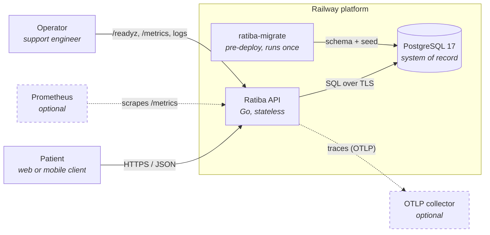
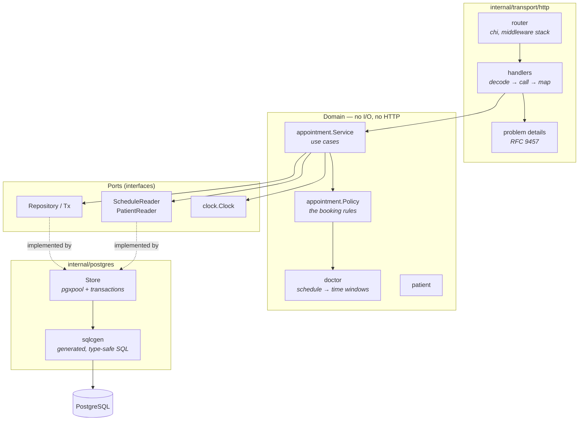
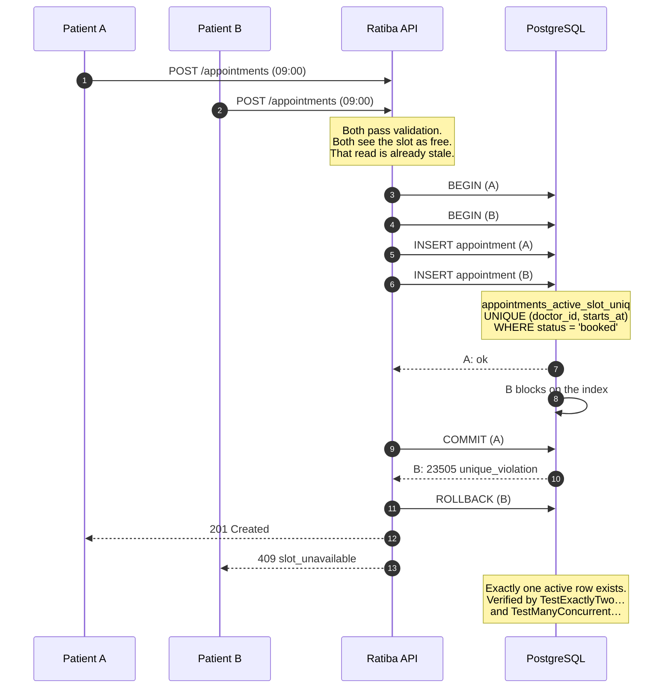
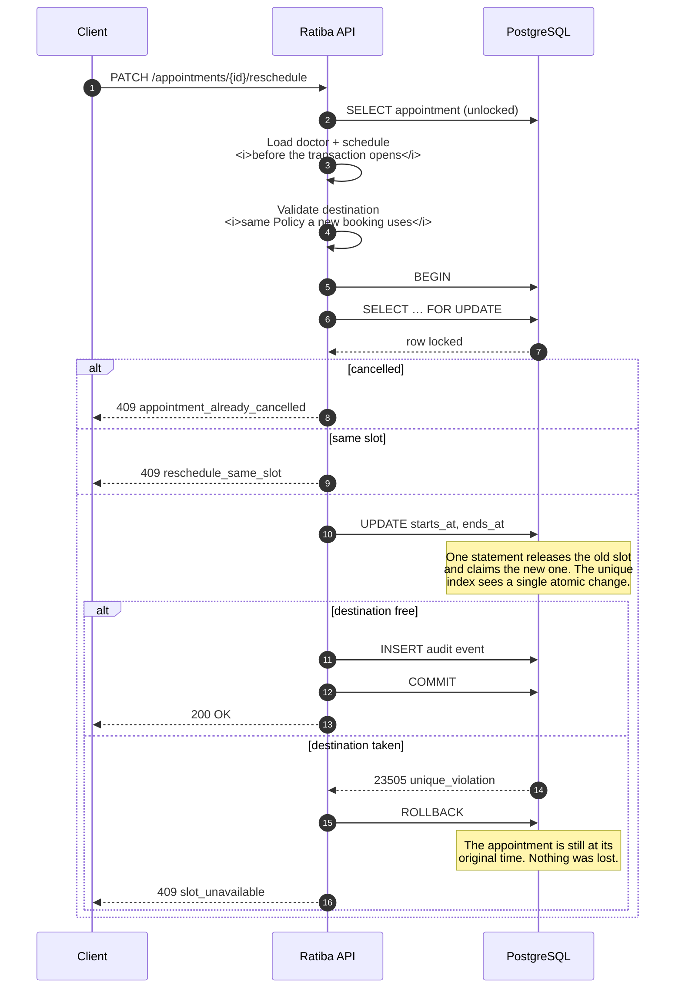
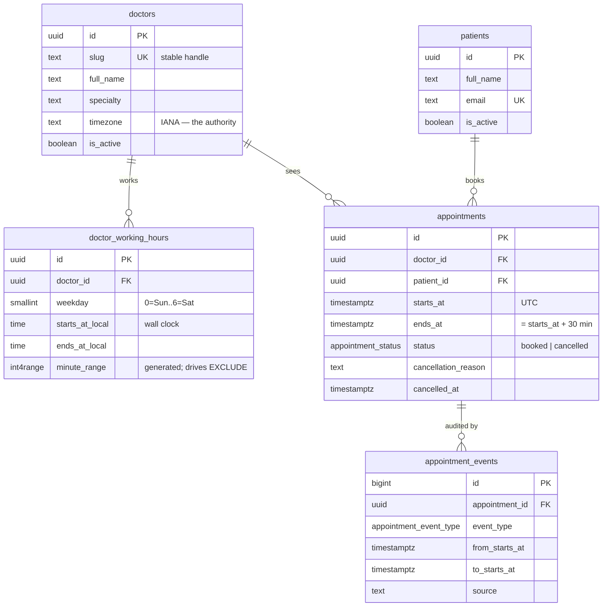

# Ratiba — Clinic Appointment API

> *Ratiba* is Swahili for **schedule**.

A REST API for booking 30-minute clinic appointments, written in Go against
PostgreSQL. Built for the Savannah Informatics backend take-home assessment.

**Status:** design complete, implementation starting. This document is Section 1
of the brief — the models, components, decisions and trade-offs, written before
any code.

---

## The problem

> *"We run a small clinic with 5 doctors. Patients need to book appointments
> online. Each doctor has set working hours and works in 30-minute slots. A
> patient should see which slots are free for a given doctor on a given day, pick
> one, and book it. Once booked, that slot must not be available to others.
> Patients should also be able to cancel. We're starting small but want to grow."*

### Scope

**Required**

- `POST /appointments` — book a slot, validated against working hours, the past, and existing bookings
- `GET /doctors/{id}/availability?date=YYYY-MM-DD` — free 30-minute slots for a doctor on a date
- `PATCH /appointments/{id}/cancel` — cancel with a reason; the slot becomes bookable again
- `PATCH /appointments/{id}/reschedule` — atomic move, destination validated as a fresh booking
- Meaningful validation errors with correct HTTP status codes
- Sensible multi-file structure, and tests of the booking logic

**Bonus**

- `GET /patients/{id}/appointments` — upcoming appointments, chronologically ordered
- Reject bookings starting less than one hour from now

---

## The one hard constraint

Booking looks like CRUD until you notice this:

> **Two patients must never hold the same slot.**

It has an uncomfortable property: **it cannot be enforced by reading.** Any
availability check is stale the moment it returns. Between "is 09:00 free?" and
"insert the appointment", another request can commit. The window can be made
small; it cannot be made zero.

So the decision has to be made somewhere it can be **atomic with the write**,
and somewhere that still works with more than one application replica. That
single requirement drives most of what follows.

---

## System design

### Context

The API is stateless. Every piece of state that matters lives in PostgreSQL,
which is what makes horizontal scaling a configuration change rather than a
redesign.

### Components

Dependencies point inward. The domain declares the interfaces it needs and knows
nothing about pgx, chi or HTTP — which is why the entire rule set can be tested
in milliseconds with no database.

### Booking under concurrency

This is the sequence that matters. Two patients want the same slot:

The application never decides who wins. It asks the database to insert, and
treats a unique-constraint violation as the authoritative answer. Any check
performed in Go before the insert exists only to produce a *better error message
faster* — it is never the thing that prevents the conflict.

### Rescheduling atomically

Rescheduling is where a naive implementation loses an appointment. "Delete the
old, insert the new" leaves the patient with nothing if the second step fails.

Loading the doctor and schedule *before* opening the transaction is deliberate.
Acquiring a second pool connection while holding a transaction is how a
connection pool deadlocks itself under load; the service maintains the invariant
that no repository read ever happens inside a `WithinTx` callback.

### Data model

The invariants, and where each is enforced, are in
[docs/data-model.md](docs/data-model.md).

---

## Key decisions and trade-offs

Full records are in [docs/adr/](docs/adr/). In brief:

### Correctness belongs in the database

A partial unique index on `(doctor_id, starts_at) WHERE status = 'booked'` is
the whole no-double-booking mechanism. The application will insert and treat a
constraint violation as the authoritative answer, rather than deciding for
itself.

*Alternatives considered.* An application-level lock fails across replicas. A
`SELECT … FOR UPDATE` on the doctor row serialises every booking for that doctor,
including unrelated slots. An `EXCLUDE` constraint over a range handles arbitrary
overlapping durations, but slots here are fixed and aligned, so equality on the
start instant is enough — and a unique index is smaller, faster and legible.

*Trade-off.* If appointments ever gain variable durations this must become an
exclusion constraint. Recorded in
[ADR 0003](docs/adr/0003-concurrency-strategy.md).

### One policy shared by three endpoints

Availability, booking and rescheduling run through the same `appointment.Policy`,
so a slot offered by the availability endpoint is bookable *by construction* and
a reschedule destination is validated by literally the same code as a fresh
booking.

"Aligned to `:00`/`:30`" is defined as membership in the generated slot list
rather than a separate modulo check. Two rules that must agree eventually
disagree — particularly across a DST transition, where wall-clock alignment and
30-real-minute stepping diverge. A test feeds every offered slot back through
the booking validator to keep the two honest.

### Timezones: store instants, interpret in the doctor's zone

Instants stored as UTC `timestamptz`. A doctor's IANA timezone is the sole
authority for interpreting their working hours and for deciding which calendar
day a slot belongs to. The host machine's timezone is never consulted.

Working hours are stored as wall-clock time plus a zone, not as a UTC offset — an
offset is correct for half the year in any DST zone.

### Modular monolith, not microservices

One bounded context and five doctors. Splitting across a network would replace a
database constraint with a distributed transaction — a correctness downgrade, not
a scaling strategy. Clear internal seams keep extraction possible later.
([ADR 0001](docs/adr/0001-modular-monolith.md))

### Idempotent booking

`POST /appointments` accepts an `Idempotency-Key`. The key, a fingerprint of the
request and a snapshot of the original response are written in the **same
transaction** as the appointment, so a committed key always has a committed
appointment and a retry can be answered from the stored response alone.

The failure this protects against is not a double-click — it is a network
timeout, where the client cannot tell whether the booking happened. Retrying
risks a duplicate; not retrying risks a patient believing they have an
appointment they do not. ([ADR 0005](docs/adr/0005-idempotent-booking.md))

### Deliberately out of scope

| Not building | Why |
|---|---|
| Authentication / authorisation | Not in the brief. Will be documented as a known gap and a threat-model boundary rather than half-built — a decorative control is worse than an absent one |
| Rate limiting | Needs shared state across replicas to mean anything |
| Notifications, billing, a frontend | Not in the brief |
| Recurring appointments, waitlists, overbooking | Not in the brief; each would change the slot model |
| A cache | Availability is a single indexed query |

---

## Ambiguities, decided

The brief leaves these open. Decisions recorded here, to be honoured by the
implementation and the tests:

1. **Appointment duration is exactly 30 minutes**, enforced by a `CHECK`
   constraint rather than left to application code.
2. **Slot starts align to `:00`/`:30` in the doctor's timezone**, defined as
   membership in the generated slot list.
3. **A slot must fit entirely within one working-hours interval.** A 16:45 start
   in a day ending at 17:00 is rejected — the appointment would run past closing.
4. **The lead-time boundary is `starts_at >= now + 1h`.** Exactly one hour is
   allowed; one second less is not.
5. **Working-hours intervals cannot cross midnight**, which keeps "which local
   day does this slot belong to?" a single-day question everywhere.
6. **Cancelled appointments are retained**, never hard-deleted. The audit trail
   is the point, and only active rows participate in the uniqueness rule.
7. **Cancellation requires a non-blank, length-bounded reason.**
8. **The patient list returns future active appointments only** — "what do I
   still need to show up for?", not "what is my history?".
9. **Availability is advisory.** A listed slot can be taken a millisecond later;
   only the booking endpoint is authoritative.
10. **An inactive doctor is rejected identically everywhere** — availability,
    booking and rescheduling all refuse, rather than offering slots that cannot
    be booked.

11. **Rescheduling to the slot an appointment already occupies returns a
    conflict**, not a silent success. A success would append a `rescheduled`
    audit event describing a move that never happened, or return `200` having
    recorded nothing — both make the audit trail untrustworthy.
    ([ADR 0006](docs/adr/0006-reschedule-semantics.md))

---

## Documentation

| Document | What it covers |
|---|---|
| [docs/architecture.md](docs/architecture.md) | Layers, dependency direction, transaction boundaries, trust boundaries |
| [docs/data-model.md](docs/data-model.md) | Tables, constraints, indexes, state transitions, timezone representation |
| [docs/adr/](docs/adr/) | Numbered decision records |

Timezone and slot representation is the subtlest part of the domain; its
reasoning is in [ADR 0004](docs/adr/0004-timezones-and-slots.md).

---

## License

MIT. See [LICENSE](LICENSE).
