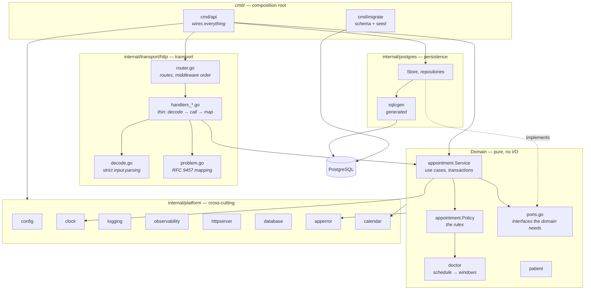
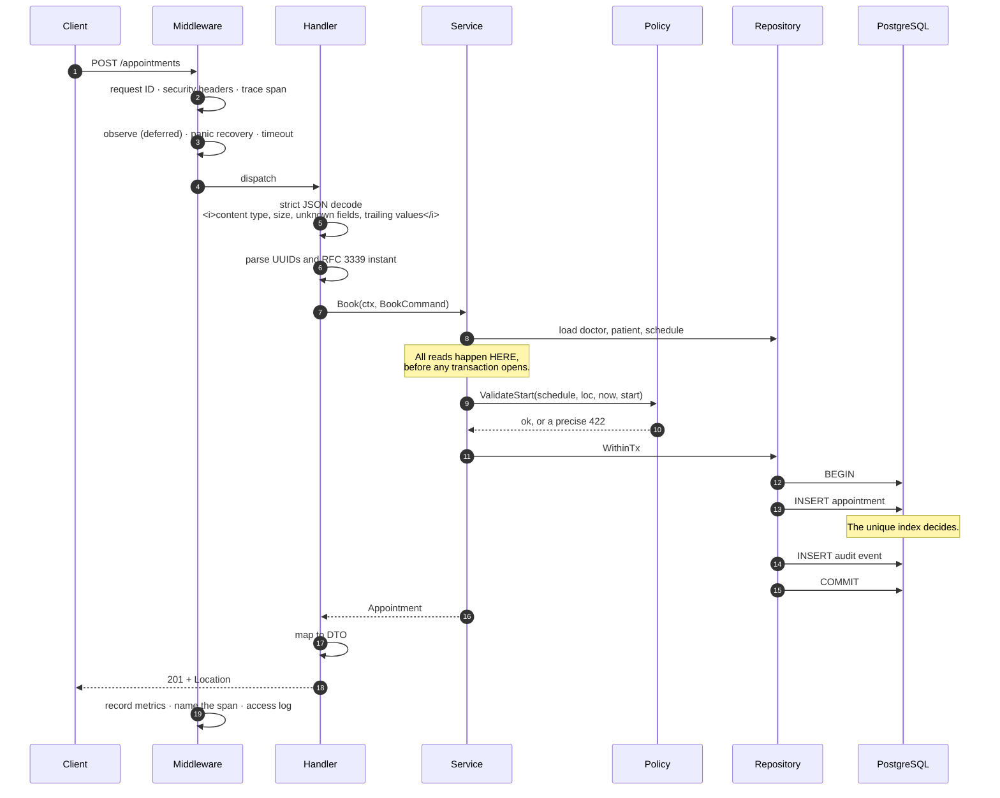
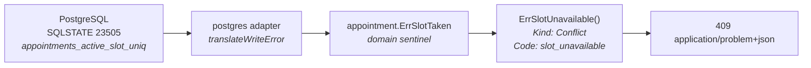
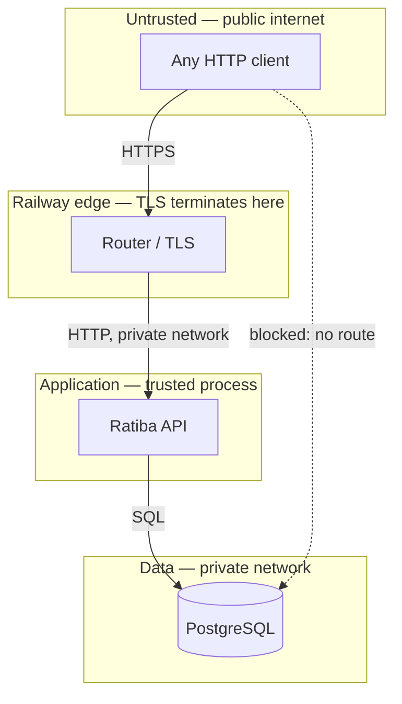

# Architecture

The intended shape of Ratiba, and the reasoning behind it. Written before the
implementation, per Section 1 of the brief; it will be revised as the build
either confirms or contradicts it. For the decisions behind individual choices,
see [adr/](adr/).

---

## The shape of the problem

Booking looks like CRUD until you notice the one hard constraint: **two patients
must never hold the same slot**. Everything else — validating working hours,
rendering availability, cancelling — is straightforward. That single invariant is
what the architecture is arranged around.

It has an uncomfortable property: **you cannot enforce it by reading**. Any check
performed before a write is stale the moment it returns. Between "is this slot
free?" and "insert the appointment", another request can commit. Widening the
window does not help; the window can be made small but never zero.

So the invariant is enforced where a decision can be made atomically: inside
PostgreSQL, by a unique index. Every architectural choice below follows from
that.

---

## Planned layers and dependency direction

**Dependencies point inward.** `internal/appointment` imports `doctor`,
`patient`, `apperror`, `calendar` and `clock` — and nothing else. It has no
knowledge of `net/http`, `pgx`, or Prometheus.

That is not architectural decoration. It is what should make the entire rule set
testable in milliseconds with no database — including the DST edge cases, which
are otherwise miserable to exercise.

### The ports

The domain declares the interfaces it needs, rather than importing an
implementation:

| Port | Purpose |
|---|---|
| `Repository` | Reads, plus `WithinTx` for anything that writes |
| `Tx` | The transactional write surface: lock, create, cancel, move, append event |
| `ScheduleReader` | The narrow slice of `doctor.Repository` the service actually uses |
| `PatientReader` | Likewise for patients |
| `clock.Clock` | The only way to read the current time |

Declaring them at the consumer keeps the dependency honest — the service asks
for exactly what it uses, and a test double is a few lines.

---

## Request flow

A booking request, end to end:

### Middleware order, and why

Outermost first:

| # | Middleware | Why it sits there |
|---|---|---|
| 1 | `otelhttp` | Starts the server span, so everything below runs inside it |
| 2 | `requestID` | Every later layer, including panic recovery, can log the correlation ID |
| 3 | `securityHeaders` / `cors` | Cheap, and must apply to error responses too |
| 4 | `observe` | Wraps recovery, so a panic is still counted and logged as the 500 the client received |
| 5 | `recoverPanic` | Converts a panic into a problem document |
| 6 | `timeout` | Innermost, so the deadline covers handler work only |

`observe` must do its bookkeeping **after** the inner handler returns. That is
the only moment the router has resolved the route template — and logging the raw
path instead would put patient UUIDs into every log line and give the metrics an
unbounded label.

---

## Package responsibilities

| Package | Owns | Must not |
|---|---|---|
| `cmd/api` | Wiring, signal handling, lifecycle | Contain business logic |
| `cmd/migrate` | Schema and seed data | Be run by API replicas at startup |
| `internal/appointment` | Booking rules, use cases, transaction boundaries | Import HTTP or SQL |
| `internal/doctor` | Doctors, working hours, wall-clock → absolute windows | Know about appointments |
| `internal/patient` | Patient records | Grow beyond a directory |
| `internal/postgres` | pgx, SQLSTATE codes, constraint names | Leak pgx types outward |
| `internal/transport/http` | Routing, decoding, DTOs, error mapping | Contain a business rule |
| `internal/platform/*` | Config, clock, logging, metrics, tracing, server lifecycle | Depend on domain packages |
| `internal/testsupport` | In-memory doubles | Be imported by production code |

### Why `doctor` knows nothing about appointments

`doctor.Schedule.WindowsOn(date, loc)` answers one question: *which absolute time
windows does this doctor work during on this local date?* It does not know what a
slot is or how long an appointment lasts.

Slot arithmetic lives in `appointment.Policy`, which consumes those windows. The
split means changing the appointment duration touches one package, and the
timezone logic — the genuinely subtle part — is isolated and independently
testable.

---

## Transaction boundaries

Every state change runs inside exactly one transaction, opened by
`Repository.WithinTx`.

| Use case | What is in the transaction |
|---|---|
| **Book** | INSERT appointment · INSERT audit event |
| **Cancel** | `SELECT … FOR UPDATE` · UPDATE to cancelled · INSERT audit event |
| **Reschedule** | `SELECT … FOR UPDATE` · UPDATE start/end · INSERT audit event |

Read-only paths (availability, listings) run outside a transaction: the API is
already documented as advisory there, and holding a transaction for a read would
cost a connection for no correctness benefit.

### The invariant that prevents pool deadlock

> **No method reads through the repository, doctor reader or patient reader from
> inside a `WithinTx` callback.**

Every read happens before the transaction opens. This needs to be stated in a comment on the service itself, because it is the
kind of rule that gets broken by a well-meaning refactor.

Acquiring a second pool connection while holding one is a classic self-inflicted
deadlock: under load, every connection in the pool ends up held by a transaction
that is waiting for a connection that will never be free. It is invisible in
testing and catastrophic in production.

This is why `Reschedule` reads the appointment *unlocked* first, to learn which
doctor it belongs to, then loads the schedule, and only then opens the
transaction and re-reads the row under lock. The first read is advisory; the
locked read is authoritative.

### Isolation level

Default `READ COMMITTED`. Correctness does not rest on the snapshot — it rests
on the row locks taken by `LockAppointment` and on the partial unique index, both
of which behave identically at any isolation level. `SERIALIZABLE` would add
retry-on-40001 handling for no benefit. See
[ADR 0003](adr/0003-concurrency-strategy.md).

### Lock ordering

Cancel and reschedule each lock exactly one appointment row and never a second.
With only one lock ever held, there is no ordering cycle and therefore no
deadlock between these paths. Booking takes no explicit row lock at all — it
relies on the index.

---

## Error handling

An error crosses three layers, gaining precision and losing internal detail:

- **`apperror.Kind`** is coarse (`conflict`, `not_found`, `unprocessable`) and is
  what the transport maps to a status code. The domain never mentions HTTP.
- **`apperror.Code`** is a stable string that is part of the public contract.
  Clients branch on it; it does not change without a version bump.
- **`Message`** is always safe to show an unauthenticated caller.
- **The cause** is attached with `WithCause` and reaches logs only.

Anything the adapter does not recognise is passed through unchanged and becomes
a `500`. Silently turning an unknown server fault into a `4xx` would be far worse
than a noisy `500`.

---

## Scaling model

The API is **stateless**. All state is in PostgreSQL. Scaling out is a
`numReplicas` change, and the no-double-booking guarantee is unaffected — the
unique index is enforced by the database regardless of how many processes are
talking to it.

What must be checked before scaling out:

1. **Connection budget.** Pool size × replicas must stay within the database's
   `max_connections`, with headroom for migrations and manual sessions.
2. **Migrations must stay a pre-deploy step**, never a startup step. N replicas
   racing to migrate is a reliable way to corrupt a schema.

Where it would strain first, in order:

| Bottleneck | Response |
|---|---|
| Connection pool | Raise the pool ceiling within the server's budget, or add PgBouncer |
| Availability queries | Index-backed by design; cache with a short TTL only if measurement demands it |
| Contention on one popular doctor | Expected behaviour, not a fault |
| Write volume | Partition `appointments` by month; the audit table is append-only and partitions naturally |

---

## Trust boundaries

- **Internet → edge.** TLS terminates at Railway. The application never sees a
  certificate and does not attempt HSTS.
- **Edge → application.** Plain HTTP over Railway's private network. Everything
  from here is treated as untrusted input: bodies are size-limited and strictly
  decoded, path parameters are validated, and the inbound `X-Request-Id` is
  sanitised before it reaches a log field.
- **Application → database.** Parameterised SQL exclusively. The connection
  string is a secret and is redacted everywhere it could be printed.
- **No authentication boundary is planned.** Every caller will have the same,
  complete authority. This is a deliberate scope decision for the assessment and
  the single largest gap in the design; it needs its own decision record and a
  threat model before submission.

---

## What was deliberately not built

| Not built | Why |
|---|---|
| Microservices | One bounded context. Distributed transactions to protect one unique index would be a downgrade. |
| CQRS / event sourcing | The append-only `appointment_events` table gives the audit trail without the read-model machinery. |
| A repository interface per entity | Interfaces exist where there is a real seam (persistence, time). One per type would be ceremony. |
| A DI container | `cmd/api/main.go` wires everything explicitly, in about eighty readable lines. |
| A caching layer | Availability is one indexed query. A cache would add a staleness bug to a problem that does not exist. |
| Generic `Result[T]` / functional error plumbing | Ordinary Go errors, wrapped with context. |

---

## Related reading

- [ADR 0001 — Modular monolith](adr/0001-modular-monolith.md)
- [ADR 0002 — PostgreSQL as system of record](adr/0002-postgresql.md)
- [ADR 0003 — Concurrency strategy](adr/0003-concurrency-strategy.md)
