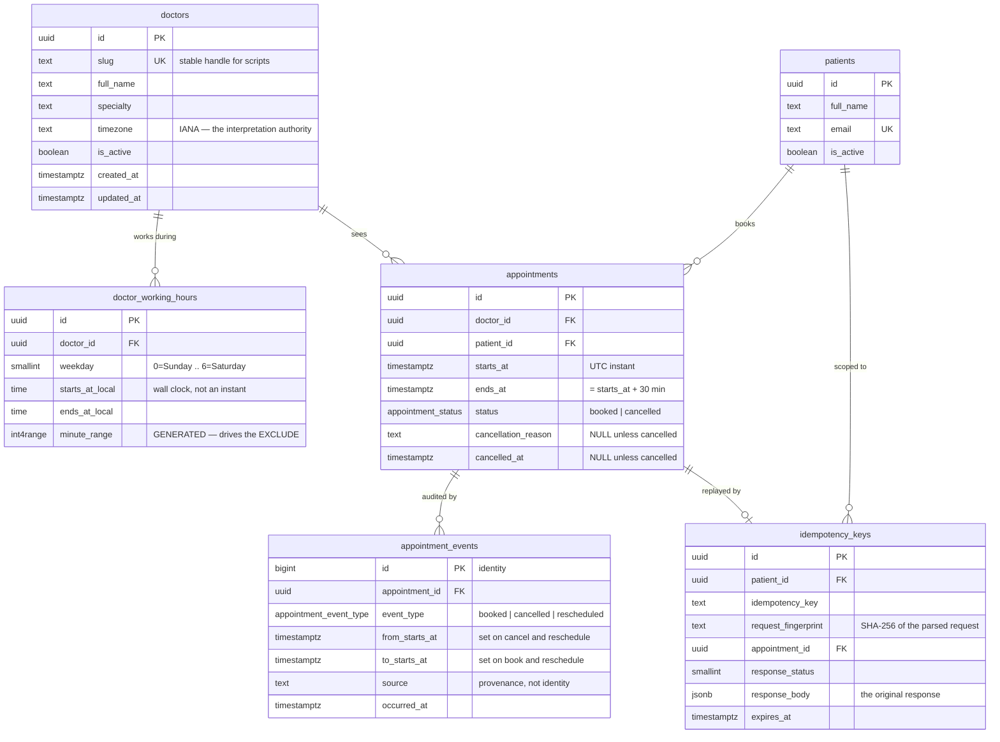
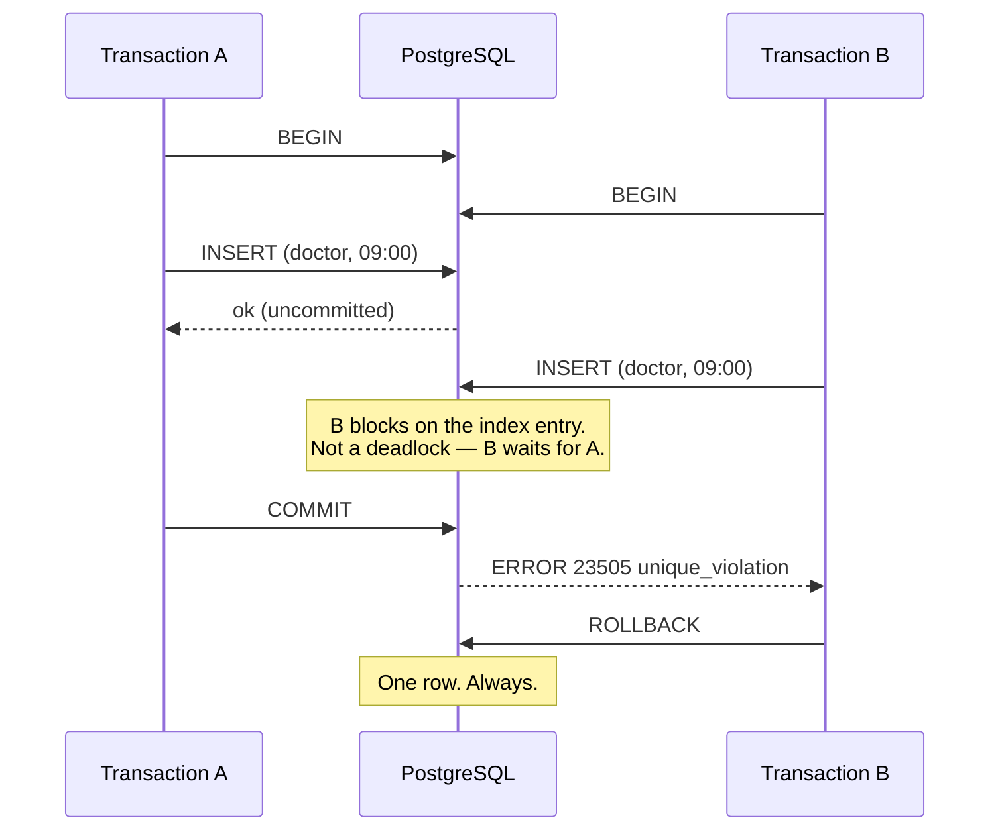
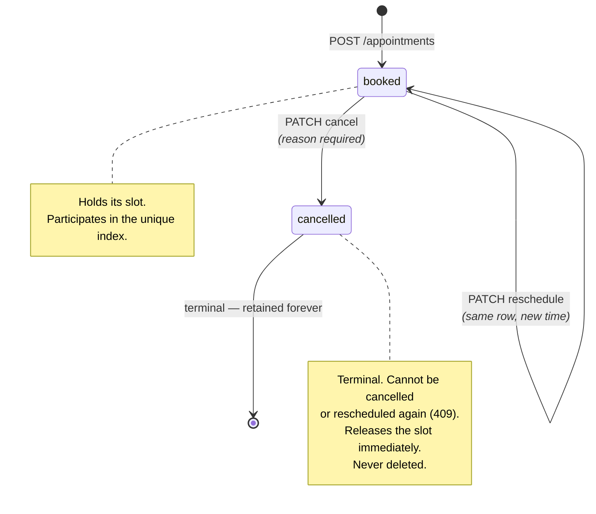

# Data model

Schema in [`db/migrations/`](../db/migrations/); queries in
[`db/queries/`](../db/queries/), compiled by sqlc into
`internal/postgres/sqlcgen/`.

The organising principle: **an invariant that matters is enforced by the
database, not only by the application.** Application checks produce good error
messages quickly; constraints are what make the rule true.

---

## Entity relationships



---

## Tables

### `doctors`

| Column | Type | Notes |
|---|---|---|
| `id` | `uuid` | Non-sequential; leaks no volume information |
| `slug` | `text` | Unique, lowercase-hyphenated. Lets scripts and smoke tests address a doctor without a UUID lookup |
| `timezone` | `text` | **IANA zone name.** The authority for interpreting this doctor's working hours and for deciding which calendar day a slot belongs to |
| `is_active` | `boolean` | `false` means no availability and no bookings; existing appointments are untouched |

`timezone` is the single most consequential column in the schema. Storing a UTC
offset instead would break twice a year for any DST zone.

### `doctor_working_hours`

A weekly recurring template, in the doctor's **local wall clock**.

| Column | Type | Notes |
|---|---|---|
| `weekday` | `smallint` | `0`=Sunday … `6`=Saturday, matching Go's `time.Weekday` so no translation table is needed |
| `starts_at_local` | `time` | Wall clock, not an instant. "09:00" means 09:00 to the doctor, whatever the UTC offset is that day |
| `ends_at_local` | `time` | Exclusive |
| `minute_range` | `int4range` | **Generated, stored.** Exists only so a GiST exclusion constraint has a range type to work with |

Intervals are half-open `[start, end)` and **cannot cross midnight**. That
restriction keeps *"which local day does this slot belong to?"* a single-day
question everywhere in the codebase — a genuinely simplifying constraint, and one
an overnight clinic would need revisited.

The `minute_range` generated column exists because PostgreSQL has no built-in
range type over `time`. Rather than storing minutes-since-midnight (readable in
neither `psql` nor a migration), the wall-clock columns stay authoritative and
the range is derived:

```sql
minute_range int4range GENERATED ALWAYS AS (
    int4range(
        (EXTRACT(HOUR FROM starts_at_local) * 60 + EXTRACT(MINUTE FROM starts_at_local))::int,
        (EXTRACT(HOUR FROM ends_at_local)   * 60 + EXTRACT(MINUTE FROM ends_at_local))::int
    )
) STORED
```

### `appointments`

| Column | Type | Notes |
|---|---|---|
| `starts_at` | `timestamptz` | UTC instant. Inclusive |
| `ends_at` | `timestamptz` | UTC instant. **Exclusive** |
| `status` | `appointment_status` | An enum, not free text — a typo cannot create a third state |
| `cancellation_reason` | `text` | `NULL` unless cancelled |
| `cancelled_at` | `timestamptz` | `NULL` unless cancelled |

Only two statuses, and cancelled rows are **retained, never deleted**. That is
what makes cancellation free: since only `booked` rows participate in the
uniqueness rule, a cancellation releases the slot with no extra bookkeeping and
the audit trail stays complete.

### `appointment_events`

Append-only history, written in the **same transaction** as the change it
describes, so the trail cannot drift from reality.

Deliberately free of patient-identifying text **and of cancellation reasons**.
The reason lives on the appointment row where the business needs it; duplicating
it into an event stream that might be exported to analytics is how clinical free
text ends up somewhere it should not be.

`source` is coarse provenance (`"api"`, `"seed"`), not an authenticated actor —
this service has no authentication. When auth lands, this becomes the natural
place for an actor ID.

### `idempotency_keys`

| Column | Notes |
|---|---|
| `request_fingerprint` | SHA-256 over the **parsed** fields, not the raw bytes, so whitespace and key ordering do not create false conflicts |
| `response_body` | The original response, so a replay returns what the client first saw |
| `expires_at` | Swept by `ratiba-migrate purge-idempotency` |

Scoped `(patient_id, idempotency_key)`. See
[ADR 0005](adr/0005-idempotent-booking.md).

---

## The concurrency invariant

Everything rests on one index:

```sql
CREATE UNIQUE INDEX appointments_active_slot_uniq
    ON appointments (doctor_id, starts_at)
    WHERE status = 'booked';
```

**Partial** is what makes it work. Only active rows participate, so:

- Two active appointments for one doctor at one start time are impossible.
- A cancelled row does not block rebooking — the slot frees the instant the
  cancellation commits, with no cleanup.
- The history of a slot is preserved: many cancelled rows may share
  `(doctor_id, starts_at)`.

### How a race resolves



The adapter translates `23505` on `appointments_active_slot_uniq` into
`appointment.ErrSlotTaken`, which the service maps to `409 slot_unavailable`.
`TestConstraintTranslation` pins that mapping, so renaming the constraint in a
migration fails a test rather than silently degrading the conflict into a `500`.

### Why not an exclusion constraint

An `EXCLUDE USING gist (doctor_id WITH =, tstzrange(starts_at, ends_at) WITH &&)`
would handle arbitrary overlapping durations. It is not used because:

- Slots are **fixed at 30 minutes and aligned**, so two appointments overlap if
  and only if they start at the same instant. Equality is sufficient.
- A B-tree unique index is smaller, faster, and understood by every engineer who
  will ever read this schema.
- It requires no extension on the appointments table.

If durations ever become variable, this **must** become an exclusion constraint.
Recorded in [ADR 0003](adr/0003-concurrency-strategy.md).

The one place an exclusion constraint *is* used is `doctor_working_hours`, where
intervals genuinely have arbitrary lengths and must not overlap:

```sql
CONSTRAINT doctor_working_hours_no_overlap EXCLUDE USING gist (
    doctor_id  WITH =,
    weekday    WITH =,
    minute_range WITH &&
)
```

This needs the `btree_gist` extension (standard contrib), so equality operators
on `uuid` and `smallint` can be mixed with range overlap in one GiST index.

---

## Complete constraint inventory

| Constraint | Table | Guarantees |
|---|---|---|
| `appointments_active_slot_uniq` | `appointments` | **No double booking.** The core invariant |
| `appointments_duration_check` | `appointments` | `ends_at = starts_at + 30 min`. A wrong-length appointment cannot exist |
| `appointments_whole_minute_check` | `appointments` | `EXTRACT(SECOND …) = 0`. Sub-minute precision would let two "identical" slots differ by seconds and slip past uniqueness |
| `appointments_cancellation_consistency_check` | `appointments` | Cancelled ⇔ has both a reason and a timestamp. A half-cancelled row is impossible |
| `appointments_cancellation_reason_length_check` | `appointments` | 1–500 characters after trimming |
| `doctor_working_hours_no_overlap` | `doctor_working_hours` | A doctor cannot have overlapping intervals on a weekday |
| `doctor_working_hours_order_check` | `doctor_working_hours` | `start < end` |
| `doctor_working_hours_alignment_check` | `doctor_working_hours` | Both ends on a 30-minute boundary with zero seconds — otherwise generated slots could not be `:00`/`:30` aligned |
| `doctor_working_hours_weekday_check` | `doctor_working_hours` | `0..6` |
| `doctors_slug_format_check` | `doctors` | Lowercase-hyphenated |
| `patients_email_format_check` | `patients` | Basic shape |
| `idempotency_keys_scope_key` | `idempotency_keys` | One response per `(patient, key)` |
| `idempotency_keys_fingerprint_check` | `idempotency_keys` | 64 lowercase hex characters |
| Foreign keys | all | `ON DELETE RESTRICT` on appointments — a doctor with appointments cannot be deleted out from under them |

Every one is exercised by `TestDatabaseEnforcesInvariants`, which writes SQL
**directly**, bypassing the application. The point is that the schema protects
the data even against a future code path that forgets to validate.

---

## Indexes

| Index | Serves |
|---|---|
| `appointments_active_slot_uniq` | The invariant, and conflict detection |
| `appointments_doctor_starts_at_idx` | `GET /doctors/{id}/availability` — booked starts for a doctor in a range. Partial on `status = 'booked'`, so it stays small as cancellations accumulate |
| `appointments_patient_starts_at_idx` | `GET /patients/{id}/appointments` — `(patient_id, starts_at, id)` matches the query's `ORDER BY` exactly, so no sort is needed |
| `doctor_working_hours_doctor_weekday_idx` | Schedule lookup |
| `appointment_events_appointment_idx` | Audit trail retrieval |
| `idempotency_keys_expires_at_idx` | The retention sweep |

---

## Appointment state transitions



Rescheduling keeps the same row and the same `id` — it is a move, not a
replace-and-recreate. That is what lets a single `UPDATE` release the old slot
and claim the new one atomically, and what makes the audit trail a coherent
history of one appointment.

---

## Timezone representation

| Concept | Stored as | Why |
|---|---|---|
| An appointment's start | `timestamptz` (UTC) | An instant is unambiguous. Rendering is presentation |
| A doctor's working hours | `time` + IANA zone on the doctor | "09:00 local" must survive DST. Storing an offset would break twice a year |
| A requested calendar date | Not stored — a query parameter | Interpreted in the doctor's zone at request time |

Round trip for "book 09:00 with Dr. Wanjiru on 2026-09-07":

1. Client sends `2026-09-07T06:00:00Z` (or `…T09:00:00+03:00` — same instant).
2. The doctor's zone `Africa/Nairobi` resolves the local date to `2026-09-07`.
3. `doctor.Schedule.WindowsOn` turns `09:00`–`13:00` local into absolute instants.
4. `Policy.SlotsOn` steps through in **absolute time**, so each slot is exactly
   30 real minutes.
5. The requested start must equal one of those instants.
6. `06:00:00Z` is stored.

Under DST, the wall clock stays fixed and the UTC instant shifts — a 09:00
appointment stays at 09:00 local. If a transition falls *inside* a working
window, that window has fewer real hours than the clock suggests and the
generator emits correspondingly fewer slots, because a slot is only emitted if it
fits entirely inside the window. Tested in
[`policy_test.go`](../internal/appointment/policy_test.go) and
[`doctor_test.go`](../internal/doctor/doctor_test.go).

---

## Retention and audit

| Data | Retention | Rationale |
|---|---|---|
| `appointments` | Indefinite, including cancelled | Clinical records; the audit trail is the point |
| `appointment_events` | Indefinite, append-only | Never updated or deleted |
| `idempotency_keys` | `BOOKING_IDEMPOTENCY_TTL` (24 h) | A replay window, not a record |

Purging expired keys is a manual command:

```bash
ratiba-migrate purge-idempotency
```

Kept explicit rather than run as a background goroutine: a scheduled job is
visible, has logs, and cannot silently stop the way a forgotten goroutine can.

**Not implemented:** patient data deletion for a right-to-erasure request. It
would need a documented policy on what to do with clinical records that are
subject to retention requirements — a compliance decision, not a coding one. See
[security](security.md).

---

## Making a schema change

See [CONTRIBUTING](../CONTRIBUTING.md#database-migrations). The rules that matter
most:

1. Every migration needs a working `Down`. CI migrates all the way down and back
   up on a throwaway database.
2. Migrations must be **forward-compatible with the running code** — during a
   deploy the old version is still serving while the migration runs. Use
   expand/contract: add nullable, backfill, require it in a later release.
3. Run `make generate` afterwards; sqlc reads the migrations directly.
