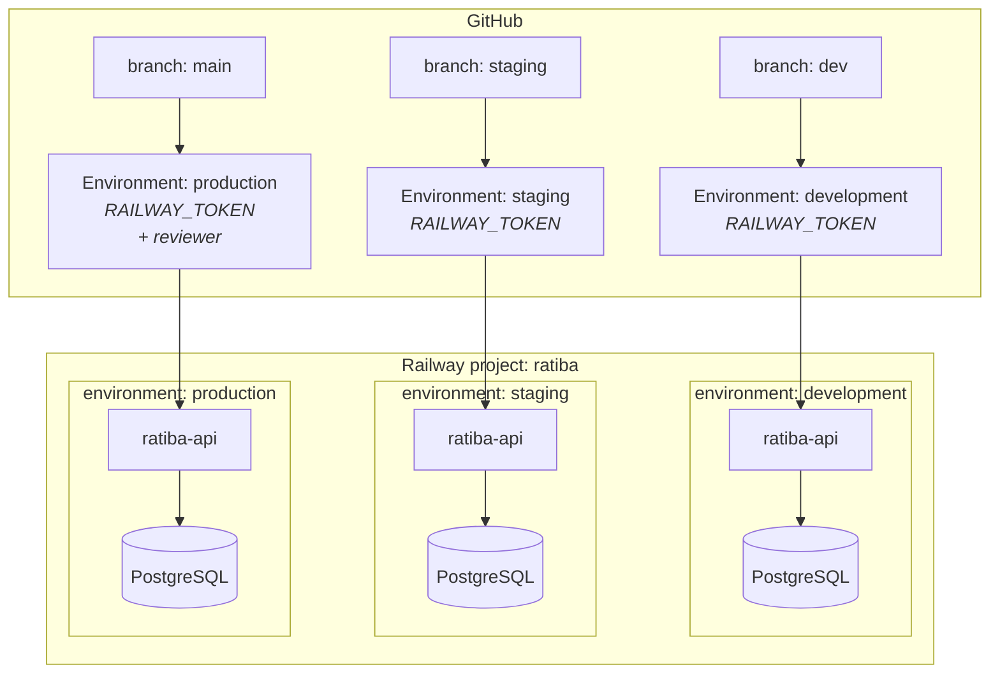
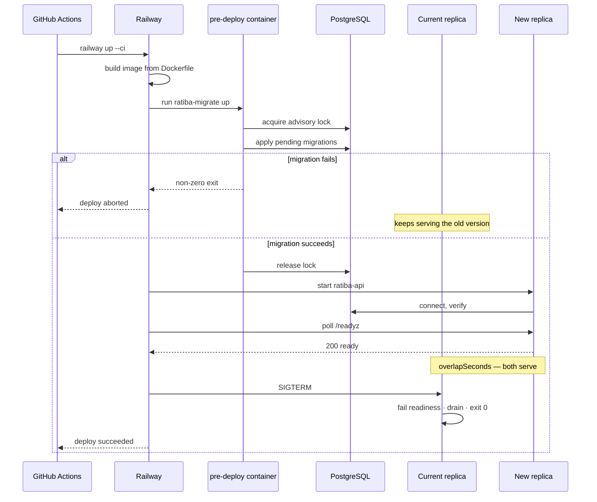

# Deployment

**Current status: deployed.** All three environments are live on Railway, each
with its own PostgreSQL, its own secrets, and its own project-scoped deploy
token.

| Environment | Branch | URL |
|---|---|---|
| production | `main` | https://ratiba-api-production.up.railway.app |
| staging | `staging` | https://ratiba-api-staging.up.railway.app |
| development | `dev` | https://ratiba-api-development.up.railway.app |

This document separates, explicitly:

- **Automated** — happens with no human action once secrets exist
- **Manual prerequisite** — a person must do it once, in a dashboard or CLI

---

## Topology



| Git branch | GitHub environment | Railway environment | Database | Purpose |
|---|---|---|---|---|
| `dev` | `development` | `development` | dedicated | Integration |
| `staging` | `staging` | `staging` | dedicated | Release validation |
| `main` | `production` | `production` | dedicated | The submitted application |

**Nothing is shared.** Each environment has its own PostgreSQL and its own
project-scoped Railway token. A leaked development token cannot reach production
data, and no environment can point at another's database.

---

## How a deploy is triggered

The assessment asks for automatic deployment "when a PR is merged into a
designated branch". GitHub Actions has **no "pull request merged" event**.
Merging a PR produces a `push` to the target branch, and that push is the
trigger:

```yaml
on:
  push:
    branches: [dev, staging, main]
```

This is the standard mechanism, and it is why
[`deploy.yml`](../.github/workflows/deploy.yml) keys off `push` rather than
`pull_request`.

### What the workflow does

1. **Resolve** the target environment from the branch. One mapping, in one place.
2. **Re-run the quality gates** against the merge commit. The PR was tested
   against a *merge preview*; this is the commit that will actually be deployed.
3. **Check the configuration is present** — a precise error naming the missing
   secret beats a confusing Railway CLI failure.
4. **Deploy** with `railway up --ci --service <service>`.
5. **Railway runs the pre-deploy migration** (`ratiba-migrate up`). If it fails,
   the release is aborted and the previous version keeps serving.
6. **Poll `/readyz`** with bounded exponential backoff, up to 40 attempts.
7. **Verify the deployed commit** matches the one that was pushed — this catches
   the case where readiness passed because the *previous* version was still
   serving.
8. **Smoke test.** Read-only against production; the full write lifecycle against
   development and staging.
9. **Summarise** the environment, commit, URL and result in the job summary.

Deployments are **serialised per environment** by workflow concurrency, so two
quick merges cannot have the older commit land last. `cancel-in-progress` is
deliberately `false` — aborting a deploy mid-rollout is worse than waiting.

---

## Railway configuration

[`railway.json`](../railway.json) is committed and identical across
environments; everything that differs is a Railway variable. Each key is
explained in [railway-config.md](railway-config.md).

The line that matters most:

```json
"preDeployCommand": ["/usr/local/bin/ratiba-migrate up"]
```

Migrations run **once**, in a separate container, from the **same image** that
will serve traffic, **before** any new replica starts. This is why the API
binary never migrates on startup: N replicas racing to apply migrations is a
classic way to corrupt a schema or deadlock a rollout.



### Migration safety during a rolling deploy

The old version is **still serving** while the migration runs. A migration must
therefore be forward-compatible with the code already deployed.

Use expand/contract:

| Release | Action |
|---|---|
| 1 | Add the column as **nullable**, deploy code that writes both old and new |
| 2 | Backfill |
| 3 | Add `NOT NULL`, deploy code that reads only the new column |
| 4 | Drop the old column |

A single migration adding a `NOT NULL` column with no default breaks every insert
the currently-running version attempts.

---

## First deployment

**All of this is manual** and requires account access. Roughly 20 minutes.

### 1. Railway project and environments

```bash
railway login
railway init --name ratiba

# The default environment is 'production'; add the other two.
railway environment new development
railway environment new staging
```

### 2. A PostgreSQL per environment

**Once per environment** — this is the step that keeps the data isolated:

```bash
railway environment development && railway add --database postgres
railway environment staging    && railway add --database postgres
railway environment production && railway add --database postgres
```

Verify each environment has its **own** database service before continuing.
Pointing staging at production is the single most damaging mistake available
here.

### 3. Service variables

For each environment, in the Railway dashboard or via `railway variables --set`:

```bash
APP_ENV=production                       # or development / staging
DATABASE_URL=${{Postgres.DATABASE_URL}}  # a REFERENCE, not a literal
LOG_FORMAT=json
LOG_LEVEL=info
METRICS_ENABLED=true
METRICS_AUTH_TOKEN=<openssl rand -hex 32>
DB_MAX_CONNS=10
BOOKING_MIN_LEAD_TIME=1h
```

Notes:

- **Do not set `PORT`.** Railway injects it.
- Use the `${{Postgres.DATABASE_URL}}` reference so a rotated password
  propagates without a redeploy.
- `METRICS_AUTH_TOKEN` is **mandatory** in production — the service will refuse
  to start without it. Generate a distinct token per environment.

### 4. Railway tokens

Create one **project-scoped** token per environment (Project Settings → Tokens).
A project token is already bound to one environment, so a workflow using it
cannot deploy to the wrong one. Do **not** use an account-wide token.

Pass it as `RAILWAY_TOKEN`. The account-wide variable is `RAILWAY_API_TOKEN`;
they are not interchangeable.

> **The CLI must be 4.33.0 or newer.** Railway changed how project tokens are
> exchanged, and older CLIs — 4.5.3 was pinned here — reject a perfectly valid
> project token with:
>
> ```
> Unauthorized. Please login with `railway login`
> ```
>
> That message points at the token, so the natural response is to rotate it,
> which changes nothing. If a freshly minted token authenticates locally but the
> same token fails in CI, compare `railway --version` on both sides before
> touching the secret.

### 5. GitHub Environments

Create `development`, `staging` and `production` (Settings → Environments).

Per environment:

| Kind | Name | Value |
|---|---|---|
| **Secret** | `RAILWAY_TOKEN` | The project token for that Railway environment |
| Variable | `RAILWAY_SERVICE` | The Railway service name, e.g. `ratiba-api` |
| Variable | `PUBLIC_URL` | The public URL, e.g. `https://ratiba-production.up.railway.app` |

For `production`, add a **required reviewer** protection rule. This still
satisfies "deploys automatically on merge" — the deploy is *triggered* by the
merge and *gated* on approval; nobody has to initiate it by hand.

### 6. Branch protection

Settings → Branches, for `main`, `staging` and `dev`:

- Require a pull request before merging
- Require the **`CI passed`** status check
- Require conversation resolution
- Block force pushes and deletion
- Require one approving review where the plan allows it

`CI passed` is a single aggregate job that fails if **any** required job did not
succeed — including skipped or cancelled ones, which a plain `needs` would let
through.

> These settings could not be applied or verified from this machine. They are
> recommendations, not claims.

### 7. Deploy

```bash
git push origin dev
```

Watch the Actions run. On success, verify:

```bash
curl https://<dev-url>/readyz
bash scripts/smoke.sh https://<dev-url>
```

Then promote: `dev` → `staging` → `main`, by pull request each time.

### 8. Record the URL

Put the production URL in the README's status table. **Only after it responds.**

---

## Rollback

### Application

Redeploy the previous release from Railway's deployment history (or
`railway redeploy`). The image is immutable, so this is exact.

### Database — forward-fix, do not roll back

**Down-migrations are not run in production.** Every migration has a tested
`Down` section, and CI exercises them, but they exist for local development and
CI.

The reason: a down-migration that reverses `ADD COLUMN` runs `DROP COLUMN`. That
destroys every value written since the migration applied. **The schema goes back;
the data does not.** For a clinic, that is patient bookings gone.

Instead:

1. Roll the **application** back to the previous release. Immediate, safe, and
   restores service.
2. Write a **new** migration that corrects the schema forward.
3. Deploy it through the normal pipeline.

This is slower under pressure and it is the right trade-off: a rollback that
destroys data turns a bad deploy into a data-loss incident.

### If a migration fails mid-deploy

Railway aborts the release and the previous version keeps serving — you are not
down. See [runbooks/failed-migration.md](runbooks/failed-migration.md).

---

## Environment teardown

```bash
railway environment delete development
```

Deletes the database and its data. For production, take and **verify** a dump
first.

---

## Verified vs. not

| Item | Status |
|---|---|
| Dockerfile builds; image runs as UID 65532; no shell present | **Verified locally** |
| `compose.yaml` and the observability profile validate | **Verified locally** |
| Migrations apply, roll back and reapply | **Verified locally and in the integration suite** |
| Seeding is idempotent | **Verified** — run twice, same result |
| Graceful shutdown drains and exits 0 | **Verified** — observed in container logs |
| Smoke script passes against a real container | **Verified** — 27/27 |
| `railway.json`, including the pre-deploy migration | **Verified in all three environments** — logs show the advisory lock, migration to version 3, and seed |
| Three isolated environments, databases and tokens | **Created and verified** |
| Public URLs | **Live** — `/readyz` healthy in all three |
| Read-only smoke against production | **17/17** |
| Full write lifecycle against development and staging | **27/27** |
| `/metrics` returns 401 in production without a token | **Verified** |
| GitHub Actions deploy workflow | **Verified end to end** — a push to `dev`, `staging` and `main` each deployed the matching environment, polled `/readyz` and passed its smoke suite. CI is green on all three. |
| CI on a **pull request** | **Not yet observed** — the `pull_request` trigger is configured, but every run so far was push-triggered, because branches were promoted by direct merge. |
| Deployed-commit verification | **Gating** — the commit is stamped into the binary at build time and the step now fails on a mismatch. Both stamping paths verified locally; the first deploy carrying this change is the end-to-end proof. See below. |

### How the deployed commit gets into the binary

`GET /` reports the commit the running binary was built from. Getting it there is
less obvious than it looks, because Railway builds from the source `railway up`
uploads and **passes no Docker build args at all**. For a long time the service
reported `"commit": "unknown"` for exactly that reason, and the deploy workflow's
verification step warned about it on every single deploy while gating nothing.

The mechanism now:

1. The deploy workflow writes the short SHA to `.commit` in the working directory
   before `railway up`.
2. `railway up` uploads it as part of the build context.
3. The Dockerfile reads `.commit` if it exists, and falls back to the `COMMIT`
   build arg otherwise, so `make docker-build` still stamps correctly from a
   local checkout.
4. The value is linked in with `-X main.commit=...`.

Two traps worth knowing, because both fail silently:

- **`.commit` must not be listed in `.gitignore`.** `railway up` honours
  `.gitignore` by default (there is a `--no-gitignore` flag to disable it), so
  ignoring the file would drop it from the upload and the service would go back
  to reporting `unknown` with nothing to indicate why.
- **The identity has to be bound to the binary, not supplied at runtime.** A
  Railway service variable would have been easier, and wrong: a service variable
  can change without a rebuild, so a rollout that silently failed would keep
  serving the old image while reporting the new commit. That is precisely the
  case the verification step exists to catch, so sourcing the value that way
  would make the check pass exactly when it should fail.

`version` is still `dev` in every environment. The same mechanism would fix it;
it is not wired up because a version string carries no information here that the
commit does not.

The verification step now exits non-zero on a mismatch rather than warning. A
check that cannot fail is not a check.
