# Security

## The headline

**Ratiba has no authentication.** Any caller who can reach the service can list
patients, and can book, cancel or reschedule any appointment.

This is a deliberate, documented scope decision for a take-home assessment
running on fictitious data — not an oversight, and not something the code
pretends to have solved. It would be unacceptable for real patient data. What
would change is set out in [Deferred controls](#deferred-controls) and
[ADR 0007](adr/0007-deferred-authentication.md).

Everything else that *could* be done without inventing an identity model has
been.

---

## Threat model

### Assets

| Asset | Sensitivity | Where it lives |
|---|---|---|
| Appointment records | **High** — who is seeing which doctor and when is clinical information | `appointments` |
| Cancellation reasons | **High** — patient-entered free text, potentially clinical | `appointments.cancellation_reason` |
| Patient names and emails | **High** — personal data | `patients` |
| Doctor schedules | Low — effectively public | `doctor_working_hours` |
| `DATABASE_URL` | **Critical** — full data access | Environment variable |
| `METRICS_AUTH_TOKEN` | Medium — exposes internal timings and volumes | Environment variable |

### Trust boundaries

```mermaid
flowchart TD
    subgraph untrusted["Untrusted — public internet"]
        Client["Any HTTP client"]
        Attacker["Attacker"]
    end

    subgraph edge["Railway edge — TLS terminates"]
        LB["Router"]
    end

    subgraph app["Application"]
        API["Ratiba API"]
    end

    subgraph data["Private network"]
        PG[("PostgreSQL")]
    end

    Client -->|HTTPS| LB
    Attacker -->|HTTPS| LB
    LB -->|"HTTP, private"| API
    API -->|SQL| PG
    Attacker -.->|"no route"| PG

    style untrusted fill:#3a1f1f,stroke:#a33
    style data fill:#1f3a1f,stroke:#3a3
```

**There is no authentication boundary.** Every caller has the same, complete
authority. That is the defining property of this threat model.

### Threats and status

| # | Threat | Status | Detail |
|---|---|---|---|
| T1 | SQL injection | **Mitigated** | Parameterised queries exclusively, generated by sqlc. No string concatenation anywhere |
| T2 | Double booking via a race | **Mitigated** | Partial unique index; proven by concurrent integration tests |
| T3 | Resource exhaustion via large bodies | **Mitigated** | `HTTP_MAX_BODY_BYTES`, enforced by `http.MaxBytesReader` before parsing |
| T4 | Slow-client connection exhaustion | **Mitigated** | `ReadHeaderTimeout` and the full timeout set |
| T5 | Unbounded result sets | **Mitigated** | Every collection is paginated with a hard ceiling |
| T6 | Credentials in logs | **Mitigated** | `Config` implements `slog.LogValue`; a raw config cannot be logged. Tested |
| T7 | Clinical data in logs | **Mitigated** | Cancellation reasons and patient names are never logged. Tested |
| T8 | Log injection via headers | **Mitigated** | Inbound `X-Request-Id` is charset- and length-validated, else replaced |
| T9 | Metrics exposing internals | **Mitigated** | Bearer token, mandatory in production |
| T10 | Debug endpoints in production | **Mitigated** | pprof refused at startup in production; separate listener otherwise |
| T11 | Container escape / privilege escalation | **Reduced** | Distroless, non-root UID 65532, no shell, no package manager |
| T12 | Vulnerable dependencies | **Reduced** | `govulncheck` in CI; 12 direct dependencies |
| T13 | Internal error disclosure | **Mitigated** | Client sees a fixed message; the cause goes only to logs |
| T14 | Enumeration of appointments | **NOT mitigated** | No authorisation. UUIDs make guessing impractical, which is obscurity, not access control |
| T15 | Unauthorised booking or cancellation | **NOT mitigated** | Anyone can cancel anyone's appointment |
| T16 | Patient data harvesting | **NOT mitigated** | `GET /patients` returns names and emails |
| T17 | Denial of service by request volume | **NOT mitigated** | No rate limiting |
| T18 | CSRF | **Not applicable** | No cookies, no ambient authority |
| T19 | XSS | **Not applicable** | JSON only; `nosniff` set. `/docs` serves HTML but renders no user input |

---

## Implemented controls

### Input handling

Every request body is decoded strictly:

- `Content-Type: application/json` required → `415`
- Size-limited before parsing → `413`
- **Unknown fields rejected** → `400`. A typo like `start_at` would otherwise be
  silently ignored and book the zero time
- **Trailing JSON rejected** → `400`. A doubled body cannot smuggle a second
  document past validation
- UUIDs, dates, timestamps and string lengths validated before anything is
  persisted
- Timestamps must carry an offset — no guessing a timezone

### SQL

All queries are written in `db/queries/` and compiled by sqlc into parameterised
prepared statements. There is no code path that builds SQL from a string. The
one place raw SQL is written by hand is the seed command, and it is parameterised
too.

### Errors

A client never sees an internal error. `apperror.Error` carries a `Message` that
is safe for an unauthenticated caller and a separate `cause` that reaches logs
only. Unrecognised database errors become a generic `500` rather than being
guessed at — silently mislabelling a server fault as a `4xx` would be worse.

### Transport

| Control | Value |
|---|---|
| `X-Content-Type-Options` | `nosniff` |
| `Referrer-Policy` | `no-referrer` |
| `X-Frame-Options` | `DENY` |
| `Cache-Control` | `no-store` — responses are per-patient |
| CORS | **Off by default.** `*` rejected at startup. Credentials never allowed |
| TLS | Terminated at Railway's edge. HSTS is the edge's concern; the app never sees a certificate |

No Content-Security-Policy: for an API that serves no HTML to a browser it would
be decoration. `/docs` is the exception and renders no user input.

### Secrets

- Never committed. `.gitignore` and `.dockerignore` both exclude `.env`; only
  `.env.example` is tracked, with no real values
- `DATABASE_URL` is redacted wherever it could be printed, including the
  connection-failure path
- `Config.LogValue` means a config **cannot** be logged raw
- Metrics tokens are compared with `subtle.ConstantTimeCompare` — an early-return
  comparison is measurably guessable
- On Railway, `DATABASE_URL` is a **reference** (`${{Postgres.DATABASE_URL}}`),
  so a rotated password propagates without a redeploy

### Container

| Control | Implementation |
|---|---|
| Minimal base | `gcr.io/distroless/static-debian12:nonroot` |
| Non-root | `USER 65532:65532`, numeric so a `runAsNonRoot` check can verify it without `/etc/passwd` |
| No shell | Verified in CI — the build job **fails** if `/bin/sh` becomes reachable |
| No package manager, no compiler | Multi-stage build; the runtime stage copies only two binaries |
| Static binaries | `CGO_ENABLED=0` |
| No build paths in the binary | `-trimpath` |
| Direct exec | `ENTRYPOINT ["…"]` — the binary is PID 1 and receives `SIGTERM` |

Final image: **47.7 MB** — a 2.6 MB distroless base plus the two static binaries
(21.1 MB for the API, 10.0 MB for the migrator; the API carries the embedded IANA
zone database).

### Supply chain

- 12 direct dependencies, each chosen deliberately (one, `kin-openapi`, is test-only)
- `go.sum` verified in CI with `go mod verify` — detects a tampered proxy or cache
- `govulncheck` reports only vulnerabilities in **reachable** code paths, so the
  result is signal rather than a CVE inventory
- GitHub Actions pinned to **full commit SHAs**, with the release tag in a
  comment. A mutable `@v4` tag can be repointed by whoever owns the action
- Tool versions (sqlc, golangci-lint, Railway CLI) pinned in the Makefile and CI

### Configuration

Fail-closed. Production refuses to start with pprof enabled, text logs, an
unprotected metrics endpoint, debug logging, or a wildcard CORS origin. Refusing
to boot is correct — a service that starts with a world-readable metrics endpoint
is worse than one that stops and explains why.

---

## Deferred controls

### Authentication and authorisation — the significant gap

**Missing:** any notion of who is calling.

**Impact:** anyone can read the patient directory, and book, cancel or
reschedule any appointment given its ID.

**Why deferred:** an identity model is a substantial subsystem — credentials,
sessions or tokens, password handling, recovery flows, and a decision about
whether clinic staff are a separate principal type. The assessment did not ask
for it, and a half-built auth layer is more dangerous than an openly absent one:
it invites the assumption that the API is protected.

**What it would take:**

1. OIDC or a signed-token scheme; no bespoke password handling
2. Authorisation on every appointment path: a patient may act only on their own
   appointments; clinic staff get a broader role
3. `GET /patients` restricted to staff
4. `appointment_events.source` becomes an authenticated actor ID — the column is
   already there for it
5. Idempotency keys re-scoped from `(patient_id, key)` to
   `(authenticated principal, key)` — a one-line change, anticipated in
   [ADR 0005](adr/0005-idempotent-booking.md)
6. Audit logging of authorisation failures

The codebase is arranged so this lands as middleware plus authorisation checks in
the service, not a rewrite.

### Rate limiting

**Why deferred:** to be meaningful across replicas it needs shared state (Redis,
or PostgreSQL with a cost). Per-instance limiting gives false confidence — an
attacker simply spreads load across replicas.

**Interim mitigation:** Railway's edge provides basic protection, and every
endpoint is bounded in body size, page size and query time, so a single request
cannot be made arbitrarily expensive.

### Others

| Control | Why deferred |
|---|---|
| Audit log of *reads* | Needs an identity to attribute a read to |
| Field-level encryption | Adds key management; the database is already access-controlled and not publicly routable |
| Right-to-erasure workflow | Needs a policy decision on clinical records subject to retention requirements — a compliance question, not a coding one |
| Backup encryption and tested restore | No backup procedure exists yet; see [operations](operations.md#backup-and-restore) |
| Container image signing | Meaningful with a registry and admission control; Railway builds from source |
| WAF | Marginal for a JSON API with strict decoding |

---

## Data classification

| Data | Class | Handling |
|---|---|---|
| Cancellation reason | Clinical free text | Stored on the row. **Never logged, never in metrics, never in traces, deliberately absent from the audit event table** |
| Patient name, email | Personal | Stored. Never logged |
| Appointment times | Clinical | Stored. `starts_at` appears in domain logs — a timestamp alone does not identify a patient, and it is what makes conflicts diagnosable |
| Doctor ID, name | Business | Freely logged |
| Request ID, trace ID | Operational | Freely logged. Deliberately random and meaningless |

The cancellation reason is the sharpest case. It is patient-entered free text and
may contain anything from "traffic" to a diagnosis. It is stored because the
clinic needs it, and it is kept out of every observability surface — including
the append-only event table, since an event stream is the kind of thing that gets
exported to analytics later.

---

## Reporting a vulnerability

This is an assessment project, not a live service. For a real deployment there
would be a documented disclosure address and response commitment here.

---

## Summary

**Strong** where it costs nothing to be strong: injection, resource exhaustion,
secret handling, container hardening, error disclosure, supply chain, and
fail-closed configuration.

**Absent** where the assessment did not ask and a half-measure would mislead:
authentication, authorisation, rate limiting.

The distinction is the point. Every gap here is deliberate, written down, and
paired with what closing it would involve — rather than left for a reviewer to
discover.
